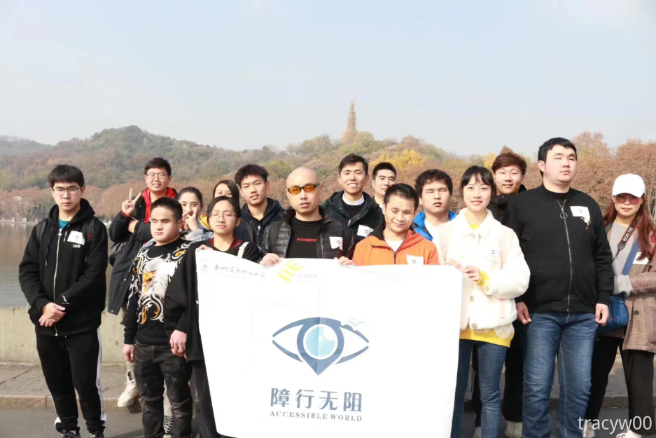

# ♿ 首页

<figure><figcaption>
2019年12月，西湖毅行
</figcaption></figure>

“无障碍”是产品、设备、服务、车辆或环境的设计，以便残障人士可以使用。无障碍设计的概念和无障碍开发的实践确保了“直接访问” 和“间接访问”，即与人的辅助技术的兼容性。无障碍可以被视为“访问能力”并从某些系统或实体中受益。

无障碍的概念最早是19年年底西湖毅行时，视障圈红人金晓华跟我讲的。晓华哥当时说，其实不只是视障者出行有困难、其它类型的残障有，健全人也有。<mark style="color:blue;">**所有人都会遇到障碍，都需要无障碍。**</mark>我们的障行无阻在他的诠释下变得宏大起来：我们先帮助视障，再帮助其它残障，<mark style="color:blue;">**最后实现整个社会的无障碍化**</mark><mark style="color:blue;">。</mark>那时的概念和执行主要是围绕出行相关设施的无障碍。

信息无障碍则是22年为海尔做外包分析才开始逐渐了解。我想把无障碍推行到软件上，于是开始找无障碍群学习设计规范，读无障碍相关的书（惭愧，三年了才开始读…）。在此期间还认识了一位很强的视障极客、两位国内很有重量级的无障碍前辈，感谢前辈们的帮助和包容啦。

我大学前两年在我们项目，浙江第一个视障旅游项目当了挺久的项目经理。以后我继不继续做无障碍领域，这个说不准，但肯定的是，<mark style="color:blue;">**无障碍能继续用到绝大部分领域。**</mark>

<mark style="color:blue;">**我的天空里没有太阳，总是黑夜，但并不暗，因为有东西代替了太阳。**</mark>
