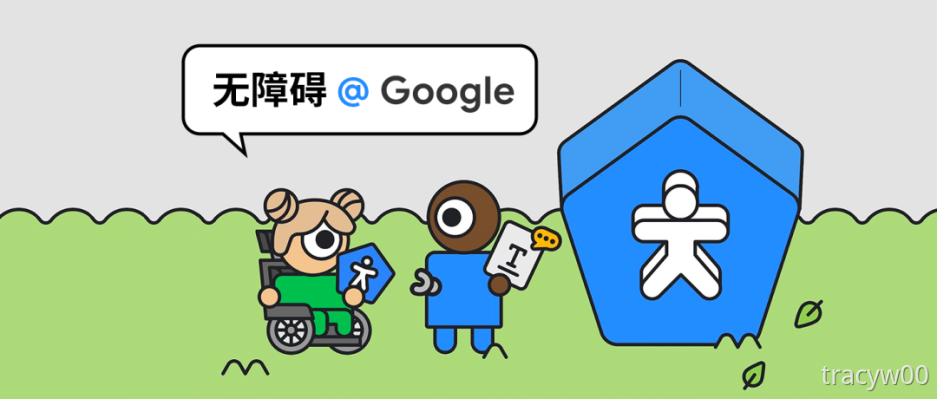

# Android无障碍组建、属性与实践

<figure><figcaption><p>图源101.dev社区</p></figcaption></figure>

作为掌握另一个主流操作系统Android的另一个大厂，谷歌也有无障碍的套件，并在开发平台Android Studio配置相关检查项。安卓开发官网有无障碍应用的设计、开发、测试等指导，可以文末跳转原文访问。

说到谷歌，大三的时候，谷歌无障碍设计师夏冰莹姐姐让我开始考虑做信息无障碍的职业。可惜我在秋招和春招都找不到太多无障碍的岗位，可能国内公司都融入到普通岗位，没必要专门有一个吧，我只能放弃我四年的积累，转头去G端做产品了。


## 01 标记界面元素 <a href="#lcrey" id="lcrey"></a>

标记界面元素指的是应用中每个界面元素都应包含描述该元素用途的说明。


### 需要标记的界面元素 <a href="#wuvgg" id="wuvgg"></a>

* 文本控件：比如TextView, Button, 安卓无障碍服务会自动读出文字本身作为说明，不需要标。
* 非文本控件：不具有text属性的元素，比如ImageButton、ImageView需要标记元素的内容。


### 标记方法 <a href="#fmd5v" id="fmd5v"></a>

**contentDescription**

大多数情况下，可以在元素的contentDescription 属性中设置标签(替代文本)。该属性中的文本不会出现在屏幕上，但如果用户启用了音频反馈的无障碍服务，当用户导航到这些控件的时候,描述文本将会被读出。


设置方法：

在布局文件XML中设置contentDescription属性

```java
<lmageView
android:id="@+id/imageview"
app:srcCompat= "@drawable/android”
android:contentDescription="Android" />
```

在代码中进行动态的设置，用setContentDescription给它设置一个标签

```java
public void onCheckedChanged(RadioGroup radioGroup, int i) {
if (i==R.id.radioButton){
imageView.setlmageResource(R.drawable.android);
imageView.setContentDescription("Android");
}else {
imageView.setlmageResource(R.drawable.apple);
imageView.setContentDescription("Apple");
    }
}
```


**hint**

主要针对的是编辑框EditText，hint代替内容描述，来帮助用户理解应该输入什么样的内容。hint的文本内容是显示在编辑框内的，当用户聚焦至编辑框或者正在输入内容时会朗读hint的内容。<mark style="color:red;">hint不能和contentDescription属性一起使用，编辑框优先使用hint。</mark>


设置方法：

```java
<EditText
android:id="@+id/editTextNumber"
android:hint="请输入0至100数字"
android:inputType="number"" />
```


**labelFor**

以一个控件作为另外一个控件的标签使用，此属性的值是控件id。使用方法类似htnl中\<label>元素的for属性。


设置方法：

```java
<TextView
android:id="@+id/textView"
android:labelFor=""@+id/radioButton"
android:text="30秒后锁屏"/>
<RadioButton
android:id=""@+id/radioButton" />
//单选按钮和左侧的文本是一一对应的，因此可以将文本作为单选按钮的标签来用
```


## 02 焦点导航 <a href="#rdesi" id="rdesi"></a>

焦点导航是允许残障用户使用定向控制器一步步的浏览用户界面控件。定向控制器包括:点击轨迹球，D-pads 、方向键、虚拟（非视觉键盘)、手势导航（Android 4.1引入)等。

应用应该支持多种导航方式，保证用户在使用基于硬件或软件定向控制时，可以导航界面布局。在一些情景下，需要保证用户界面可聚焦，或者改变焦点顺序使用户交互更具逻辑性。


### 相关属性 <a href="#suqav" id="suqav"></a>

**focusable**

针对与导航设备（硬件的按键），如键盘、D-pads等。

android:focusable属性设置为true时，允许用户使用定向控制聚焦元素并与之交互。


**focusableInTouchMode**

针对触屏情况下，不要立即执行相应的点击逻辑，而是先显示焦点（即控件被选中)，再点击才执行逻辑。

通常这个值也应该设置为true，因为视障用户通过TalkBack时,多数是通过触摸屏设备。


**importantForAccessibility**

针对的是无障碍服务，例如TalkBack就是语音和震动反馈的无障碍服务。它的作用是控制View对是否触发辅助功能事件和是否报告无障碍服务。

属性值有下面4个：

* yes ：代表此控件对无障碍服务此控件重要
* no：代表对此控件对无障碍服务不重要
* auto：代表此控件对无障碍服务的重要性由系统判断
* noHideDescendants：代表对此控件和其子元素对无障碍服务不重要

通常情况下处理无障碍服务的问题时使用importantForAccessibility属性即可。例如将importantForAccessibility值设置为no时，TalkBack无法访问此元素。


### 启用焦点 <a href="#ndyze" id="ndyze"></a>

通常对于view来说，不管是定向控制器还是无障碍服务，焦点都是默认启用的。


代码设置

```java
<Button
android:id="@+id/button"
android:focusable="true"
android:focusablelnTouchMode="true"//定向控制器
android:importantForAccessibility="yes" /> //无障碍服务
```


### 屏蔽焦点 <a href="#poo0g" id="poo0g"></a>

对无障碍访问不需要的元素（比如装饰性的分割线），可以对其焦点屏蔽。


代码设置

```java
<Button
android:id="@+id/button"
android:focusable="false"
android:focusablelnTouchMode="false"//定向控制器
android:importantForAccessibility="no" /> //无障碍服务
```


### 设置焦点顺序 <a href="#x4z9g" id="x4z9g"></a>

焦点移动顺序是根据一种算法，意在在某一特定方向上寻找相邻的元素。在极少数情况下，默认的算法可能不匹配具体的顺序。


使用物理定向控制时，例如方向键，焦点顺序是平面的，即存在上下和左右的关系。

* android:nextFocusDown：当用户向下导航时，定义下一个接收焦点的视图
* android:nextFocusUp：当用户向上导航时，定义下一个接收焦点的视图
* android:nextFocusLeft：当用户向左导航时，定义下一个接收焦点的视图
* android:nextFocusRight：当用户向右导航时，定义下一个接收焦点的视图


使用TalkBack时，焦点的顺序是线性的，只存在前后的关系。

* accessibilityTraversalAfter：本控件的顺序在id指定的控件之前
* accessibilityTraversalBefore：本控件的顺序在id指定的控件之后


## 03 设置元素类型和状态 <a href="#vtekn" id="vtekn"></a>

### 元素类型 <a href="#bzhbo" id="bzhbo"></a>

Android 常用的控件有Button、EidtText、CheckBox等，用户可以通过元素的类型来判断其交互方式。

视障用户使用TalkBack时，TalkBack会获取对应元素类型并反馈播报出来。但是如果该元素没有设置元素类型,TalkBack将不能反馈元素类型，用户将无法获知元素的交互方式，无法对元素进行操作。


常用属性：

<mark style="background-color:blue;">AccessibilityClassName</mark>

通过设置AccessibilityClassName，无障碍服务便能获取正确的的控件类型信息。AccessibilityClassName必须是SDK Framework定义的widget类的全类名，否则无效。

设置方法：自定义类设置元素类型，可以通过重写getAccessibilityClassName()方法设置元素类型。

```java
public class MyView extends View{
@Override
public CharSequence getAccessibilityClassName(){
    return Button.class.getName();
    }
}//将元素类型设置成button
```

或者在无障碍代理设置元素类型。

```java
ViewCompat.setAccessibilityDelegate(textView,new AccessibilityDelegateCompat(){
    @Override
    public void onInitializeAccessibilityNodelnfo(View host, AccessibilityNodelnfoCompat info) {
    super.onInitializeAccessibilityNodelnfo(host, info);
    info.setClassName(Button.class.getName());
    }
});
```


<mark style="background-color:blue;">RoleDescription</mark>

不需要传入widget类的全类名，只需传入自定义的CharSequence（字符串）即可。

设置方法：使用setRoleDescription()。

```java
//传入另一个自定义的“测试按钮”元素类型
viewCompat.setAccessibilityDelegate(textView_display,newAccessibilityDelegateCompat(){
    @Override
    public void onInitializeAccessibilityNodelnfo(View host, AccessibilityNodelnfoCompat info){
        super.onInitializeAccessibilityNodelnfo(host, info);
        info.setRoleDescription("测试按钮"");
    }
});
```


### 元素状态 <a href="#uaqgv" id="uaqgv"></a>

用户通过元素传达的状态信息，了解元素当前的状态从而对元素进行相应的操作，如“未选中”“已选中”。

常用属性

* Enabled：表示控件的可用状态。值为false时，talkback会播报“已停用”
* Selected：表示控件的选中状态。true时会播报“已选中”，false时不播报
* Checked：也是表示控件的选中状态。true时会播报“已选中”，false时播报“未选中”。CompoundButton便是实现了Checkable的类，子类包括CheckBox、RadioButton、 Switch 等
* StateDescription：可自定义元素状态的描述，其自定义的模式可用和Checked等状态一样通过talkback播报

```java
textView.setStateDescription("测试的状态");
ViewCompat.setStateDescription(textView,"测试的状态");
```


## 04 无障碍对象 <a href="#jhgns" id="jhgns"></a>

### AccessibilityNodeInfo <a href="#yf4zv" id="yf4zv"></a>

代表一个窗口内容节点可以从源请求的操作。

换句话说，一个自定义视图可灵活地将自己报告为一个无障碍节点信息树。一旦无障碍节点信息被发送给无障碍服务，该信息将会是不可改变的，且调用状态改变方法将会产生错误。

NodeInfo会包含一些节点信息，比如元素状态、类型，这些也可以修改。


### AccessibilityEvent <a href="#drkxj" id="drkxj"></a>

有关用户与应用中的可视化界面组件互动的消息。这些消息由无障碍服务处理后生成补充反馈和提示。

当用户界面发生某些事件时，AccessibilityEvent代表的无障碍事件会被系统发送，每一种事件类型是由该类暴露出的属性子集表示其特征的。在此类中为每一种事件类型定义了相应的常量。


## 05 无障碍API <a href="#crrjf" id="crrjf"></a>

### 无障碍API方法 <a href="#etkce" id="etkce"></a>

无障碍功能方法是View和View.AccessibilityDelegate类的一部分，和Activity的onCreate等回调方法类似。


<mark style="background-color:blue;">sendAccessibilityEvent()</mark>

当用户操作视图时，这个方法被调用。


<mark style="background-color:blue;">sendAccessibilityEventUnchecked()</mark>

当调用的代码需要直接检查设备是否激活无障碍特性(AcessibilityManager.isEnabled())的时候，调用该方法。


<mark style="background-color:blue;">dispatchPopulateAccessbilityEvent()</mark>

当自定义视图产生无障碍事件时，系统调用这个方法(自定义类中需要实现)


<mark style="background-color:blue;">onPopulateAcccessibilityEvent()</mark>

该方法为视图的AccessibilityEvent设置朗读文本提示。如果视图是另-个生成无障碍事件视图的子视图，调用该方法(自定义类中需要实现)


<mark style="background-color:blue;">onInitializeAccessibilityEvent()</mark>

系统调用此方法来获取超出文本内容的视图状态的附加信息(自定义类中需要实现)


<mark style="background-color:blue;">onlnitializeAccessibilityNodelnfo()</mark>

为无障碍服务提供视图的状态信息(自定义类中需要实现)。


<mark style="background-color:blue;">onRequestSendAccessibilityEvent()</mark>

当视图中的一个子视图生成AccessibilityEvent 时，系统调用这个方法。


### AccessibilityDelegate <a href="#otyrw" id="otyrw"></a>

此类表示给控件注册一个委托，在委托可以重写一些API方法。结合API方法便可以自定义无障碍内容，以通过组合而不是继承来增强可访问性支持。


设置方法：

通过view的兼容类（优先用这个）

```java
//eg.在onIntializeAccessibilityNodeInfo修改text属性，在不影响原text的情况下修改播报内容
ViewCompatAccessibilityDelegatet(view,new
AccessibilityDelegateCompat{}{
    @Override
    public void InitializeAccessibilityNodeInfo(View host,
AccessibilityNodeInfoCompat info) {
        super.onIntializeAccessibilityNodeInfo(host, info);
        info.setText("Nodeinfo修改text");
    }
});
```

直接给元素设置一个无障碍代理

```java
//eg.在onInitializeAccessibilityEvent中填充状态:
ViewCompat.setAccessibilityDelegate(view, new
AccessibilityDelegateCompat(){
    @Override
    public void onInitializeAccessibilityEvent(View host, AccessibilityEvent event) {
        super. onInitiaiAccessibilityEvent(host, event);
        event.setChecked(true);
}
```

