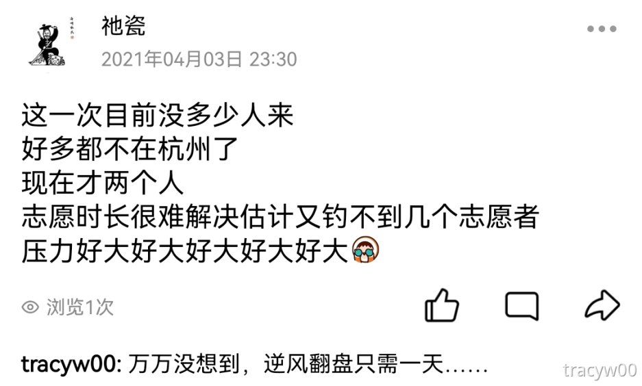

# 我的第5个国际盲人节-2023

<figure><figcaption>
四年的障行无阻，在毕业那天正式按下停止键
</figcaption></figure>

我是从19年追光者时期开始过国际盲人节的，今年是第5年，也是第40个国际盲人节。

这两天我把我的知识库“无障碍纸库”更新了，增加了gitbook版本，排版和跳转链接都比语雀的效果要好。

### 01 今年 

今年春天我突然遭遇应届生劝退，第101天才找到新的offer。在中间的一百天，我当过几回“陪诊师”，正是在炒我的公司里，产品总监跟我科普的新职业。刚开始陪视障朋友去医院，他们给我的报酬是为了补贴我请假失去的实习工资。后来逐渐变成理所当然，陪着在医院到处跑也是个很累的劳动，成为我“失业期”的一个收入来源。

今年五月我陪一对视障情侣堕胎了，姐姐是去年一次，今年又一次，男当事人是同一个。那男的刺激了我很多，对视障群体正式放下滤镜。带他们断断续续跑了十天，事情总算搞定了，但这些天在计划生育科的所见所闻让我很压抑，女性永远是最大的受害者。后来我老豆和组织经验丰富的视障朋友都说，以后这种尽量推掉，迷信上心理上对自己不好，不要老当好人。

<figure><figcaption></figcaption></figure>

<figure><figcaption>
姐姐出院后，我征得她同意把人流的流程整理出来发在朋友圈，提醒姐妹们好好保护自己
</figcaption></figure>

六月初，一对视障老朋友找我帮忙，为了答谢我，晚上带我回他们家，一起吃饭喝奶茶聊天。他们和在家暂住的师弟跟我聊起视障圈子内的八卦，还有一些国内信息无障碍机构的真相。欸什么滤镜都碎了，哪个群体都一样，林子大了什么鸟都有。

还好我也收获一些很好的伙伴。有在北京工作喜欢跑马的视障老爷爷，之前嚷嚷寄东西过来，被我推掉了。有饱读诗书的视障姐姐，交流文学的时候知识进脑子的感觉很快乐，有时会在线帮她挑裙子。有做相关研究的姐妹，她的大学我好几位朋友都在那，一开始就有亲切感，她昨天也给了我很专业的科普和鼓励。与此同时，还有虽然是行外人，但是在鼓励我的朋友、网友，谢谢大家了！💙💙

### 02 停滞 

我在[去年盲人节](http://mp.weixin.qq.com/s?\_\_biz=Mzg5NDYxMzU4Ng==\&mid=2247485170\&idx=1\&sn=89b61ee6d21212d0651b1e2def6ac95d\&chksm=c01da7cff76a2ed979e4343377e9e01bd699fbf0bdfc68d4ae10ea0f151aa971d5996b1de021\&scene=21#wechat\_redirect)说过，我想做无障碍相关的岗位，但是寻觅不到，或者是接近的岗位笔试后没有后续联系。秋招我去了数据安全行业做产品经理，它辞退应届生后我换到了g端供应链做项目经理。**信息无障碍一直想投身，一直做不成。**我现在聊以自慰的方式就是把能学的技术课程学完，有空理理我的无障碍知识库。

我带过的项目障行无阻也不顺利。去年我看着障行四代目，就开始有种**“我们好像真的要完蛋了”**的感觉。没有一个人对推进项目有积极性。我当时传承项目时，专门问到初代掌门老柴的联系方式，和他打电话请教。现在四代目呢，俊豪喊过我几次回去跟他们讲项目，都见过我了的，但只有两个加了我，一个为了追学姐，我是学姐室友的朋友；另一个更离谱，以为我是视障者。我也从来没想到，障行的介绍会是“二次元浓度高欢迎加入”，项目相关的吸引力不重点讲讲吗。所有人都像四方木，推一下才动一下，办出游活动都是队长层催了好久才办的一次，今年更完蛋，就没办。我建的200多号人的学校志愿者社群，也因为他们没有早点摆摊吸纳新生（还是我提议的两个月后才搞），群里的人很多已经毕业了，并没有很好的动用效果。

我甚至看到了我们的“盗版”，对面今年创建的。我本来想可能是四代目搞的，但一看ip肯定不是我们的人。名字、logo、简介，都太重合了。把视力障碍者叫成行障者又是啥玩意，行障不是屏风的意思吗。欸这可能是某个大学生小组为了学分临时弄的吧，目前先不管，如果真照搬项目，他们做得起来对社会也是件好事，别碰瓷我们就行。

<figure><figcaption>
上图是真假障行，李逵也说绝
</figcaption></figure>

我有件最耿耿于怀的事，四代目在他们唯一一次举行的出游里，选择的日期是周末。视障者大部分从事推拿行业，工作强度和我们相反，周一到周五上午客人少，周五晚到周天晚客人特多，所以很多推拿店老板不愿意他们在周五\~周日请假。我通过三代目提醒过四代目，**我们做项目要贴合用户的实际情况啊**，为什么不像我们前几代一样，挑工作日办活动，比如很多人的形策课大职课都安排在的周三（不是说这些课不值得上的意思，只是对学业的影响降到最低）。他们回，他们要上课啊。不是能请假吗？不想请啊。我们二代目是项目推进最多的，学业并没有太大影响，拿各种奖学金、比赛国奖，除了我和乐天选择就业外，其他二代目考研都有很不错的分数，去了985、211。当时我因为事最多，成绩跌过一年，后来也拿回国奖。我就纳闷了，他们远没有我们那么辛苦，影响学业的概率比我们小很多，为什么不会时间管理，如此不将心比心，如此懦弱。

在疫情前和疫情中，我们策划了两个省外游，江西武功山三日游和海南岛五日游，因为疫情一直办不了。其中海南岛五日游是一个很有抱负的湖北胡大叔主动找我们，想一起在有生之年做一件大事的，他主动组织了他几十年累积的视障人脉。当时我和他联系是在大一，两个姓胡的人在电话说得热泪盈眶，他还鼓励我转专业加油。现在胡大叔已经到海南岛工作了，但我们的工作已经停滞不前。

我和俊豪(同届另一个项目经理，下一任的团队队长)在大一进来的时候，在百团大战找的都是自己感兴趣的社团，想做一些有意思有意义的事情。最近两年的新生好像都被考研困住了，百团大战热门的都是有助于保研的社团，这边社创社团的热度比四年前冷清太多。

我在社团，我在障行无阻的收获相比之下多多了，也辛苦多了。我吃了苦，但是我甘心，收获的经验和人情值得。现在的新生好像都不愿吃苦了，等着坐享其成，或者是，他们陷入了对学历焦虑的苦。

### 03 四年 

我刚进入障行的时候，我压根不相信这个项目做得下去。

我的实习生项目叫“追光者”，好像名字还是我起的。当时我们八个人，抽签到“如何改善视障者出游现状”的题目，这不就跟障行一样嘛。我们为了和障行有所区别，做了长途的方向，加入了酒店、旅游当地机构的流程设计。当时我们也进行了视障者调研，大部分跑线下，我当时把线上潜入视障者QQ群也做了。但是当时很失望，调查到的视障者大部分对旅游没有很大性质，调研到的一个00后回答“在店里玩手机不就好了吗”，甚至遇到在门店就赶我走的情况。做完实习生项目转正后，可以填你想进哪些正式项目，三选二。我的旧队友们都做怕了，没有人再填障行，只有我觉得遇到的视障者们人挺好的，我有经验要不继续做吧，就把它放到首选项。最后，**追光者的人，只有我一个来了障行。**

<figure><figcaption>
没想到我还留着欸，大一的实习生项目题目
</figcaption></figure>

我在追光者已经受打击一次，进入障行后，上一任掌门又安排了一次调研，做完这次后我可谓是心如死灰。可能是因为我丧得太明显吧，文瑞(团队队长)和上任掌门先后找我单独约谈。我跟文瑞说我做不下了，我没看到希望。文瑞回答“你不继续试试怎么知道”。他当时的确牛逼有说服力(现在也牛逼，双非+工管的他本科毕业后就在华为)，我就信他了。也是在那没多久，我在萧山看博览会顺便在周边调研，走进一家叫“兰盲道”的店。里面的5个视障者跟以前遇到的完全不一样，很活泼，都是很爱玩的人。他们给了我很多办视障旅游的建议，守心旅游的群也是他们推给我的。如果我没遇到他们，我或许就甩手跑路了。

我进来后发现其实我们就噱头大，什么都没有，只有合伙人在。障行的视障者社群、志愿者社群，我建的。障行的活动装备，标记视障者的徽章（用来提醒路人注意，因为有些视障者是视神经导致失明，看起来和明眼人一样其实他看不见）、志愿者马甲、障行导游旗、导游扩音器，是我的时期添置的。合作方苏州守心旅游，我还是普通队员的时候和守心沟通好合作意向的。因为“美女群主”的身份，社群有矛盾吵起来的时候二代目一般等我出来运营，比如有个经常发广告的，有一次由于视障者有口音，语音转文字把“你们”转成了“你妈”，聊着天的另一个以为在骂他开骂回去，总之千奇百怪。后来当掌门了更加忙，需要帮助的视障者、单纯想聊天的视障者、需要视障调研对象的高校研究生、想要合作的社团机构，都找到了我头上，几乎每天都有。我室友曾戏谑，我经常出阳台回语音、打电话，像一个客服。

2020年10月，我在西溪调研前一天在大运河出了水上意外。对面的船打错方向盘撞过来了，撞的窗口刚好是我和室友坐的两个窗口。我面前的玻璃撞出蜘蛛网的裂纹，平移的窗户硬是撞成了开进来，我睁眼后看到玻璃只和我的头差几厘米，裤子被涌进来的河水打湿。我们在放假前就说好了10.6去西溪湿地调研，是好不容易协调好的日期，我是项目经理不能缺啊。于是第二天还是调研坐了一天的船，留下几个月的阴影，在被窝里抱头哭，想如果当时我死了会怎样。还好克服后整个人直接变坦荡了，也确定好了死后遗体捐献。

我即使打交道能力很强，也有不讨喜的时候。20年创行秋峰在湖畔大学，下午我趁机在附近调研。调研到第三家，大叔的语气保持得挺和善，但突然语调一转“你这些年的人生经历”“你还是赶快走吧，这里不欢迎你，欢迎下次再来”。想起自己在杭电、障行受过的种种委屈，加上第一次被绵里藏针赶出店，在店里就哭了。出了店，雨开始越下越大，边和雨一起哭边推共享单车走，最后在骑车时赶紧调整情绪和眼睛，没露馅。

障行每次举办活动是一定数量的视障者和志愿者一一匹配。视障者太少开展不了，突然变很多志愿者不够多也不行；活动为了迎合多数视障者的时间选择客人少的工作日举办，但也因此难招募志愿者。我一共办过4次活动，每次都是压力持续到活动前夜。

<figure><figcaption>
2021年太子湾公益游前夕，压力大在小号发疯(室友说tracy用德语念是它瓷，因此得名)
</figcaption></figure>

2021年秋，我尝试用个人和团队的名义申请浙江省尚德奖学金，个人奖三千团队奖五千。后来团队的在院级就被刷了，比不过运营近十年的支教项目，个人的很顺利到最后一轮，15进10。因为当时障行很拿得出手，我自己也有几项长期公益，“社会公益奖”就几个人报，怎么都进得了吧，早就盘算好拿将近一半的个人奖金捐给障行。但是，当时最后一轮的时间我没跟群里确认好，我周二进群，看到的共享文档表格写的是周四，但其实临时改到周三上午10:00了。一个小时我来不及做汇报ppt，也来不及跟下一节课的老师请假，知道当天才是汇报后，问群里的负责人可以不来吗有课，她说可以，评委们会看交上来的资料。然后最终结果一出来，获得“社会公益奖”跟最后一轮一样的人数，只不过没有我。另一个“勤工俭学奖”赛道的过了来，那人跟我同一个学院。我怎么甘心，去行政楼，再跑到科技馆问相关负责人。她们说我最后一轮没来现场就是当我弃权了，那个人是评委推荐换成这个赛道的，我可以明年再报。当初不是这么说的啊，在科技馆一楼的角落哭了一个下午。

我，我们障行二代目**从来没有障行当作是公益项目**。我们是社创项目，只不过目前是推广无障碍旅游概念的公益阶段。障行也跟学校的志愿活动不一样，我们跟流程成熟、有学校后台支持的暑期支教没有可比性。我们的工作没有工资、没有资助、没有志愿时长，疫情下活动开展不稳定，难得的电视曝光机会也在电视上被砍掉。我们的资金来源，还是前几届的前辈打创业比赛赢来的奖金。在此我有必要和三代目讲解的那样，说一下公益、志愿、慈善和社创的概念区别了：

* **公益**：全称公共利益事业，是为人民服务不求回报的一种通俗讲法。指有关社会公众的福祉和利益。eg.障行现阶段是个公益项目。
* **志愿**：志愿服务是指在不求回报的情况下，为改善社会，促进社会进步而自愿付出个人的时间及精力所作出的服务工作。eg.障行每次办活动需要招志愿者。
* **慈善**：慈善事业是人们自愿地奉献爱心与援助的行为和从事扶弱济贫的一种社会事业。eg.障行不是给视障者捐钱的组织，障行需要慈善机构的资助。
* **社创**：全称社会创新，是民间力量自发的、通过按照书籍整理的方式促进解决社会问题、改善某一范围人群生存状况的一种行动或趋势。社创是“非商业的”，但它不是“反商业的”，主张收取一定的资金以维持项目的可持续运营，能自己造血，对资金捐助的依赖性不强乃至没有。

昨天我本可以先把文章写完，再去找来出差的朋友耍的。只不过上午我写着写着，想起以往遇到的坎，不禁哭了起来，停不下来，跟当年填尚德奖的表格时一样。我不想再呆在房间emo了，出去逛逛好。我相信磨砺不是白受的，总有一天能回来的，用教员的词勉励吧：

**曾记否，到中流击水，浪遏飞舟！**

