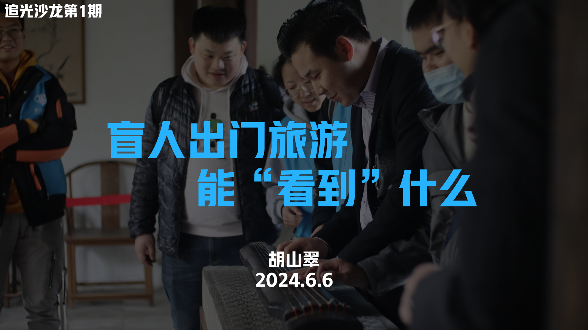

# 我的第6个国际盲人节-2024


今年开始，盲人节总结文章增加粤语朗读音频啦



前排提醒：为避免不必要的误解，我需要提前解释一下，**我不是视障者，我是明眼人。**&#x6211;刚开始在朋友圈发盲人节是为了提醒身边人多留意视障者，后来自己也投身无障碍了，逐渐演变成我的无障碍年度记录。如果需要视障调研对象，我可以帮联系我的视障朋友，但我本人不在调研对象范畴……


我是从19年追光者时期开始过国际盲人节的，今年是第6年，来到五年整。

这一年很幸运，让我感到大学毕业并没有影响我在无障碍的延续。

低落总结完[去年盲人节回顾](http://mp.weixin.qq.com/s?__biz=Mzg5NDYxMzU4Ng==\&mid=2247486610\&idx=1\&sn=cd6c7caa6eb08883089f19ad2e7c8ff5\&chksm=c01dadaff76a24b9153175ae606f3d18fd25f93baeeac2884abce7e6a024a4bfd98e371c94b8\&scene=21#wechat_redirect)后的半个月，我在知乎收到《汉语世界》编辑风帆的私信，沟通时间来个盲人旅游专题的采访，在豆瓣收到豆友对我整理无障碍纸库的感谢。我创设体系之初就是想或许能在网络帮上忙呢，三年后我终于能把铺下的长线收束，以自己的title，不再是障行的title。

过年刚回广州没几天，我在知乎私信回复不了的瑞雪兜兜转转在公众号重新联系上我，她在拜访调研场所的受挫，我想找无障碍领域的工作的碰壁，共通了起来。我在永庆坊边走边回复，中午突然下雨涉到风寒，下午两点开始浑浑沌沌，越走越想吐，赶紧回去睡觉，后来才知道这是三阳。约好的是当晚八九点和她们开腾讯会议采访，我撑完那半个小时后，倒头就睡。

3月我带朋友来西溪湿地玩，举办[西溪湿地一日游](http://mp.weixin.qq.com/s?__biz=MzU0MDk4MzA1OQ==\&mid=2247483868\&idx=1\&sn=6a3fc5ab9bef5a5402030aee067c38f4\&chksm=fb31aba0cc4622b683e665dfb75506b1d180fc8523b3d2e08cbf867c57c6d45e7a4b8f2f0bfe\&scene=21#wechat_redirect)后、四年后的第一次重返。这次障行只有我一个人在，一个人孤零零甩着障行导游旗故地重游，有种物是人非事事休的惆怅。二代目除了我都不在杭州了，散布各地。

<figure><figcaption>
20年调研，20年举办西溪一日游，24年重返。有时候看到这张对比图挺泪目的。。
</figcaption></figure>

年中我和一个罕见病组织有了联系，五年来第一次大量接触到后天视障的群体，引起我对以前的“理所当然”的反思。

> 在障行，跟大量视障朋友打交道，障行后，和各地无障碍研究生打交道。但这是我第一次遇到，对面是视障者也是研究生的情况。我也才发现，五年来我好像一直忽略了视障朋友如何学会读屏的过程。看他们都在我面前用得很流畅甚至给我秀一手盲文输入法，默认了他们都一学就会，或者早在盲校等特殊教育机构系统学习，忽略了成年后视障，早已定型的明眼人生活方式要转变的艰难，学习渠道的缺失。

<figure><figcaption>
为沙龙准备的PPT，直播当天因为临时加班来晚了，就没用上
</figcaption></figure>

我作为主讲人，和他们做了一期追光沙龙。开头思维发散很有趣，但结局不太好。我通过李勇哥邀请了艾晓娃来当嘉宾，一位在视障旅游/托养经验丰富的视障姐姐，还上过《最强大脑》。姐姐在直播前谦虚说怕怯场讲不出话，实际上她的分享很好，侃侃而谈，逻辑清晰。我和她的观点是一致的，**盲杖是个工具，并不羞耻，大大方方拿出来用。**&#x73B0;在的盲杖基本支持折叠/伸缩，携带很方便，在有些国家盲杖是有法律效应的。而用戴墨镜来提醒路人自己是视障者，效果不如盲杖好，而且这个主动贴标签的行为是在加强大众对视障者的刻板印象，很不应该这样做。我接触过的视障者有上百人，很少会在平常生活戴墨镜，戴的人也是戴功能性的墨镜（可以调整不同环境下的进光量，让他能看到东西）。况且现在出门旅游，戴墨镜的明眼人游客比比皆是，更加分不清。直播后艾姐姐被移出群聊，我收到私发的很多条对她的辩驳，带着偏激情绪。那几天我正带着桃子游玩杭州，跟她看了之后决定不回复。艾姐姐说的身份不认同，即使对面不觉得，确实发生了，正中残障研究归纳出的类型……人是我请来的，挨骂是她的，我有种把艾姐姐坑惨了的感觉，以后如果去大连旅游，得找个机会见一面请她吃顿饭。

9月，[我去杭州黑暗中对话体验馆当了会志愿者](http://mp.weixin.qq.com/s?__biz=Mzg5NDYxMzU4Ng==\&mid=2247487756\&idx=1\&sn=061ea5a65af59c6cdfc3d2c1cb665c46\&chksm=c01db031f76a392734a0ccbde52d538eee2b0b5ce345a13f37b423cd7954971f238de4cf57af\&scene=21#wechat_redirect)。我的本意是出门帮忙避免天天宅家，结果有意想不到的收获。在他们考核完那天，我和蓉姐刘宇哥一起去apple store找蓉姐男朋友沈可，试完平板和新出的iPhone 16后，晚上一起吃火锅。我和他们聊到大学做的障行，结果他们提到我这两年听到的另一间大学做的同类项目，指导老师挂得好、PPT吹得牛逼，拿到七万资金和很多荣誉。我很破防，大二时候我们不肯听创业学院的建议乱吹项目、止步省赛的六进三，那几年是疫情很难拉赞助，活动资金都是团队一代代省下来的奖金。<mark style="color:blue;">**“你们当时还是太单纯了”**</mark>，他们锐评。

<figure><figcaption>
来apple store的本意是试玩vision pro，没想到店里摆的是样品玩不了，得预约演示。预约的最后一步是登记视力状况 
</figcaption></figure>

孙雯姐趁晚上休息的间隙也过来聊了一会，她要走的时候我和她站在公交站台帮她看公交。她和我继续讲刚刚桌上提到的被大家抵触的一个项目，提醒说以后如果做社会企业/项目一定要把资金用到哪讲清楚，我们知道企业需要赚钱存活，只是不想钱花得不明不白（虽然我学到了但是我真没这实力用上啊QAQ）。这几年孙雯姐算是看着我过来的，我和她坦然讲了我最近一年的牛马和离职的经历，还有第二份工作不想听职场前辈的劝回家，和家有距离。她也理解我的选择。

和我一起做志愿者的姐姐之前在阿里待了快十年，我跟她提起我有一个意向部门，但一直没等到有岗位释放出来，最近都在小红书刷到这部门有裁员了。没想到她知道，跟我说：这个部门要么是熟悉阿里架构，从老员工转岗过来的，要么是对项目有重大突破新招的。而且这个工作经常会被派到公益落地的现场驻场，比如四川云南这些偏远山区，接受这个条件的人很多是老家就在那，一般人可能难以接受。拿什么实现重大突破？听完后心死了半截。

在黑暗中对话和他们闲暇聊天的时候，郑敏小童都对我提过同一个提问，“你在这方面有这么多经验，为什么不来这里工作呢？”我想了想，这里对我能力的发挥有限，我不太想做运营的工作，更喜欢做产品的0-1。

只不过我也知道，<mark style="color:blue;">**无障碍产品经理我一直听说有，但我从来没遇上。**</mark>

我休养到9月再开始找工作，似乎又回到了两年前，结束西门子实习投入秋招。和那时一样，看岗位、看书、一焦虑就买衣服，还有一无所获。现在我还相信努力有用吗？相信，但我已经无法再高估它了。
