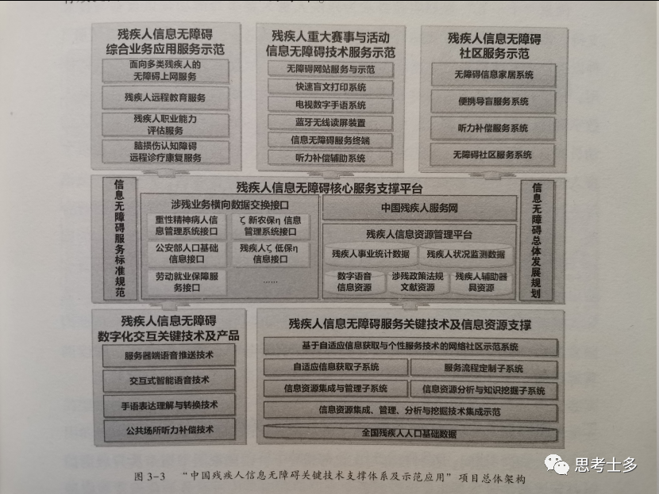

# 《无障碍与信息技术》

<figure><figcaption>
面向盲人的文化资源整合与文化服务关键技术及应用示范上图是浙江图书馆一楼的指示牌，最下面指向浙江省视障信息无障碍服务中心
</figcaption></figure>

这本书是去年去浙图看《抱残守缺》的时候借的，听名字就知道是讲无障碍相关的信息技术。该书属于《国家无障碍战略研究与应用丛书(第一辑)》，我国第一套成体系研究无障碍战略发展与应用的丛书，五年前就开始出版。但这套书的读者or从事信息无障碍的人太少啦，豆瓣词条一片空白，都是后来我建的。

> 本书旨在完整、系统地介绍我国信息无障碍领域技术研究与应用的成果。以实际问题与社会需求为背景，以信息技术为手段，重点介绍无障碍媒体转换与交互技术的研究成果。针对信息无障碍领域存在的信息交互障碍问题，发掘多媒体、大数据、人工智能等相关领域技术发展对信息无障碍领域的潜在价值与意义，并提出了合理的解决思路与方案，把理论与技术相对完整地结合起来，必将有效推动我国信息无障碍领域的建设与发展。
>
>
>
> 《无障碍与信息技术》.卜佳俊, 戴连君, 唐李真. 辽宁人民出版社2018年版

书一共有九章，我的笔记只是其中的六章，收获也颇多了，学到很多技术，导图在后台回复书名即可获取。这本书的导图目前是这套丛书里最密密麻麻的，做成两侧排版还是很长……

可能是因为我的观念是2023版，书是2018版，五年之差存在分歧。书的第四、五章讲面向视障、听障的信息无障碍实践，我草草看一遍就过了。我觉得软件层面上，实现信息无障碍最好的做法应该是把已有软件做成健全人和残障人士都能使用，优化底层逻辑和细节，更偏向“通用设计”；而不是另造一个部分功能优化、但界面粗糙到只有文字的“盲人版”。

## 01 信息无障碍 

**无障碍**起源于词汇accessibility，最早是指为各类残疾人提供可访问的产品、设备、服务、环境。有关研究表明，人们通过视觉和听觉获得信息占从外界获得的信息的<mark style="color:blue;">90%以上</mark>。互联网的信息大多以视觉方式呈现，部分信息是听觉呈现，给视障听障人群带来很大障碍。全球人口中约有15%具有不同类别不同程度的残障。

**信息无障碍**是指任何人在任何情况下都能平等地、方便地理解、交互和利用信息。<mark style="color:blue;">目的</mark>在于缩小全社会不同阶层、不同地区、不同年龄、不同健康状况的人群在信息理解、信息交互、信息利用方面的数字鸿沟，使其更加方便地参与社会生活。

信息无障碍的<mark style="color:blue;">基础</mark>是实现信息获取渠道多元化的表示，使用现有的感官做替补来弥补某些感官的缺失，利用替补的感官来获取信息。比如，视觉受阻者访问网页可以借助读屏软件，将网页中不可看见文字信息转换成可以接收的声音信息来获取网页信息。

信息无障碍对社会发展的<mark style="color:blue;">影响</mark>有三：\
①信息无障碍是弱势人群的基本发展权，缺乏信息或信息不对称，会导致弱者更弱。弱势人群的共同特点是他们的声音小，需求容易被忽视，需要社会各界高度关注支持。

②带来新的经济增长点和巨大的市场机会，包括对此领域的研发市场、研发后直接应用市场和应用后带来的增值应用市场。

③信息无障碍的建设和普及，将推动在线就业和教育的发展，提高残疾人参与社会、创造经济社会价值的机会。残疾人在信息无障碍的良好环境中可以获得许多有价值的信息，同时可以受到良好的教育，这样他们不仅能自食其力，而且可以利用学到的知识和技术为社会创造一定的价值。

信息无障碍的<mark style="color:blue;">实施</mark>需要技术标准和政策法规的共同推进。技术标准是建设和监督工作开展的基本根据，政策法规为贯彻落实提供根本保障。

## 02 研究机构及工作 

无障碍方面的工作都是国外观念产生较早，较早形成成熟的体系，国内后来追上。因此在介绍研究机构时会更多介绍国际情况，分为标准化组织、国际企业和国内研究机构。

### 标准化组织 

⭐国际标准组织/国际电工委员会(ISO/IEC)联合技术委员会

2004年ISO/IEC JTC1通过决议成立信息无障碍特别工作组(SWG-A, Special Working Group on Accessibility)，旨在整合残障人士和老年人使用信息通信产品和服务时的需求，并收集公布已有的与信息五障碍相关的标准。参与工作组的有W3C/WAI、JTC1 SC7/28/29/35/36/37、ITU-T SG16及ISO多个国家成员体。

2009年，ISO/IEC JTC1出版发行了ISO/IEC TR 29138:2009《信息技术——针对残疾人信息无障碍需求的一般考虑》（Information technology一Accessibility considerations for people with disabilities）。明确了残疾人在获取、利用信息时的需求，列举了与信息无障碍相关的标准或规范，并为用户需求和标准条款建立映射的思路和方法。

2014年，IEC、ISO、ITU联合发布了ISO/IEC Guide71: 2014，该指南是一项应用于老年人和残疾人需求的、对于产品和服务类的指南，为提高无障碍意识、关注有需求的群体提供了解决方案。

⭐万维网联盟 W3C\
W3C(World Wide Web Consortium)自建立以来一直致力于全球网页标准制定与规范，是<mark style="background-color:blue;">公认的国际范围内最有影响力的标准化组织</mark>。全世界的40个国家内建立了数百个组织，截至2017年4月1日共有461名成员。

997年推出网页无障碍组织WAI (Web Accessibility Initiative)。WAI下包括一些工作组和兴趣组，分别负责指导方针、技术报告、教育材料和其他涉及WEB访问的几个不同组成部分的文件，包括WEB内容、WEB浏览器和媒体播放器、创作工具和评估工具。

1995年5月，WAI制定并发布了网页内容无障碍指南1.0版(Web Con-tent Accessibility Guidelines 1.0，WCAG 1.0)，2018年发布2.1版。WCAG是<mark style="background-color:blue;">国际社会最有影响力且最著名的网页无障碍技术标准之一</mark>。

2005年7月，WAI发布了创作工具无障碍指南(Authoring Tool Accessi-bility Guidelines 1.0，ATAG 1.0)，2015年发布2.0版，提供用于制作网页内容（静态网页、动态网页应用等）的软件和服务。文档说明了如何在web上创作无障碍的内容使得残障人士能够利用，并给出了具体的创作建议。

移动辅助功能小组(Mobile Accessibility Task Force, Mobile A11Y TF)用于制定和规范移动开发的无障碍性，同时也根据移动端Web和应用的特性，不断地扩充WCAG和ATAG等标准。

⭐欧洲电信标准协会 ETSI

ETSI(European Telecommunications Standards Institute)成立于1998年，是非营利性的电信行业标准化组织，在全球范围内负责信息和通信技术相关的标准。

2001年出台了无障碍环境下服务标准(service accessibility etsi)。

2005年出台了儿童使用准则技术和部署的1CT产品和服务(Guidelines for the design and deployment of ICT products and services used by children)。

2013年出台了对ICT产品和服务在欧洲公共采购的无障碍要求(Accessibility requirements for public procurement of ICT products and services in Europe V1.0.0)。

### 国际企业 

⭐国际商业机器公司 IBM

IBM<mark style="background-color:blue;">最早成立了全球信息无障碍研究中心</mark>（IBM Accessibility Research Center），致力于扩大网站的用户访问范围，使残疾用户、年老感官障碍（听力或视力下降）的用户也可访问网站。

自1914年以来，开发了一大批助残产品，早期的有声打字机和盲文打印机等终端产品，目前的产品主要针对互联网应用。IBM在信息无障碍上研发了多种服务与产品。其中，辅助性服务包括数据内容检查、自动辅助测试等；在辅助手段上支持T硬件、软件和网络应用产品，使他们能够被更多的人使用。其宗旨是加速信息无障碍化发展，提高使用者经验。

⭐微软 Microsoft\
研发了Microsoft Active Accessibility技术，用于改善辅助功能在Windows系统上的应用程序中的工作方式，增强用户的可访问性。

还出台了标准MSAA（Microsoft Active Aecessibility），用于规范基于Windows的信息无障碍产品的提供标准，指定符合的无障碍要求。

⭐谷歌 Google

从产品的早期设计到最终发布，将无障碍作为一项核心考虑因素。为了评估、监测和改善其产品的无障碍发展状况，Google组建了核心无障碍团队，在团队内协调开展有关无障碍方向上的工作并对外提供相应的咨询答疑。Google的产品及运营团队都会进行相关的无障碍培训以保证在设计产品的时候能够从无障碍角度出发，给用户提供最便利的操作方式与服务。

Google研发了一系列辅助工具，比如安卓手机都会内置的针对视障用户的文字转语音软件TalkBack和导航软件WalkyTalky。

⭐苹果 Apple\
因为创始人乔布斯患有读写障碍、据说他的亲人有一位是盲人，苹果一开始就在无障碍中投入了相当大的精力，比如专门针对视障人士开发的用于Apple设备上的语音辅助工具VoiceOver、Made for iPhone助听器、手势控制、语音文字切换。

Apple做的更多是对于用户的操作辅助，更好地操作体验以及信息获取。

### 国内研究机构 

我国信息无障碍起步较晚，从2003年“大连通信残疾人信息无障碍论坛”开始才进入公众视野。<mark style="background-color:blue;">国内最早研究信息无障碍的团队</mark>大多是一些高校和科研部门，他们往往基于实验室对相关产品开发的需求，对信息无障碍进行初步的研究和探索。这些团队最初也只是基于特定产品需求进行相关研究，虽然不是成熟的信息无障碍研究团队，但也为国内的信息无障碍研究打开了一扇门。

⭐中国盲文出版社信息无障碍中心\
成立于2005年，前身是专为开发盲用软件而成立的研发小组，代表成果是阳光软件。中心成立以来，在盲用软件研发、盲用信息化产品推广、盲用信息化服务标准方面做了许多基础性和开创性的工作。

⭐中国残疾人信息和无障碍技术研究中心

立于2009年1月，由浙江大学与中国残联共同创办。在过去十年的合作中，双方不仅实现了各自事业的跨越式发展，也给全世界的残疾人提供了无障碍环境建设、信息服务等方面的多种方案，形成了许多突破性的标志成果。组织实施了中国残联系统的第一个国家科技支撑计划项目，建成了实用方便的中国残疾人人口基础数据库系统等。

⭐中国信息无障碍产品联盟 CAPA

成立于2013年11月，由深圳市信息无障碍研究会、阿里巴巴、腾讯、百度、微软（中国）共同发起的合作型<mark style="background-color:blue;">民间机构</mark>。

目前，国内重视信息无障碍并进行具体技术实践的企业主要有：IBM（中国）、腾讯、阿里巴巴、搜狗、百度等，这些企业在各自的产品线上大力发展信息无障碍技术。

W3C中国与腾讯、华为、浙江大学等国内企业和科研院所开展深入合作，有效促进一系列新兴Web标准在国内的推广、普及和应用。2014年至2018年间，浙江大学先后完成WCAG2.0、ATAG2.0、WCAG2.1等国际标准授权翻译，W3C中国下设信息无障碍社区组，着重技术交流与讨论。

### 研究工作 

**国外**信息无障碍的理念自20世纪90年代开始就已引起关注，2001年Kurniawan进行了<mark style="background-color:blue;">全球范围内的第一次</mark>针对网站无障碍的研究。研究使用了自动评价工具来比较部分商业网站的无障碍水平，研究范围涉及老龄化、健康和政府机构等领域的网站。自此之后，国际上对于网站无障碍的研究如雨后春笋涌现。

从2007年起，由于检测相关的研究已经逐渐完善，而检测结果的问题却越发突出，引起了研究热点的转变，学界集中探究在无障碍发展过程中，网页创作的无障碍水平变化和创作者的无障碍知识水平。

2008年前后，学界渐渐意识到只是制定标准依旧不够，需要<mark style="background-color:blue;">从技术规定和更新上</mark>来改善网站无障碍。全球范围内学界开始了对信息无障碍软硬件的集中研究，这期间进行了对系统构建、设计和实施的研究，开发了许多数字化信息交互工具。涉及网站设计、语音技术和辅助技术等的研究逐渐成为无障碍领域的热门主题。在全球特别是美国，开始了针对不同类别残疾人进行的软硬件开发。

2010年后，对政府网站的无障碍检测结果表明，政府网站的无障碍问题开始显著减少。此时，信息无障碍的软硬件已逐渐形成了一定规模，关于<mark style="background-color:blue;">信息无障碍的标准化</mark>工作慢慢成为研究热点。信息无障碍建设已经从最初的研究设计正式进入到<mark style="background-color:blue;">实施推广状态</mark>。

2012年以来，全球进入到了移动信息网络时代，信息无障碍的研究热点也随之<mark style="background-color:blue;">转移到移动设备上</mark>。

**在国内**，早期的研究主要围绕残疾人和网络无障碍展开。2005年，信息无障碍的研究群体开始由残疾人扩大到弱势群体的范围，关注儿童、老年人等弱势群体的信息障碍。

2008-2010年，信息无障碍的研究热点从用户<mark style="background-color:blue;">转向了无障碍设计和技术实现</mark>，此时与信息无障碍相关的技术大量涌现，如网站设计、语音技术、辅助技术等。

2011-2013年，信息无障碍<mark style="background-color:blue;">标准化</mark>的系列研究成为重点研究对象，主要包括技术标准和设计标准方面。对信息无障碍标准的研究有助于全面开展信息无障碍建设，从此信息无障碍的建设进入推广阶段。

## 03 国内实践成果 

### 法律法规 

《中华人民共和国宪法》《中华人民共和国残疾人保障法》《无障碍环境建设条例》《国家人权行动计划（2012一2015）》《“十三五”加快残疾人小康进程规划纲要》《残疾人事业信息化建设“十三五”实施方案》等。

### 政策及标准规范 

《中共中央国务院关于促进残疾人事业发展的意见》《关于加快推进残疾人社会保障体系和服务体系建设指导意见》《信息无障碍身体机能差异人群网站设计无障碍技术要求》《信息无障碍一—网站设计无障碍评级测试方法》《中华人民共和国国家标准：网页内容可访问性指南（GB/T29799一2013）》《读屏软件技术要求GB/T36353一2018》等。

### 大型综合类应用示范 

2008年北京残疾人奥运会

2010年上海世博会与上海市政府门户网站

2010年广州亚运会、亚残会

（书里没写，2022北京冬奥会、2023杭州亚运会也能算进去）

### 国家科技支撑计划项目 

<figure><figcaption>
中国残疾人信息无障碍关键技术支撑体系及示范应用
</figcaption></figure>

<figure><figcaption>
面向盲人的文化资源整合与文化服务关键技术及应用示范
</figcaption></figure>

<figure><figcaption>
残疾人康复服务支撑平台及关键技术研发
</figcaption></figure>

## 04 无障碍媒体转换与交互 

类似无障碍媒体转换与交互的方法，不仅可以帮助视力残疾人理解图像/视频信息，也可以用于帮助听力残疾人理解音频信息，语言障碍人群理解文字信息等。因此无障碍媒体转换与交互是信息无障碍<mark style="background-color:blue;">最主要的技术支撑</mark>。处理流程主要有以下五步：

### 1.无障碍媒体表达手段 

<mark style="color:blue;">——对受限通道的高维异构媒体数据进行主题表达，便于后续处理</mark>

大多数传统的图像处理方法是建立在数字信息处理和概率统计基础之上的，与人类的视觉处理存在较大差别，难以实现具有生物认知水平的图像处理和识别任务。随着神经科学与脑科学研究的不断发展，人类对生物视觉系统的研究和对大脑视觉的理解越来越深入，从初级视觉皮层到高级视觉区域，从初级视觉感知到高级知觉组织等，都取得了重要的研究成果。这些都为<mark style="background-color:blue;">计算机模拟生物视觉</mark>提供了重要参考价值。

#### 稀疏编码(sparse coding, SC) 

首先要介绍一个生物学概念“感受野”。感受野是视觉系统信息处理的基本结构和功能单元，是视网膜上可引起或调制视觉细胞响应的区域。它们被视网膜上相应区域的光感受细胞所激活，对时空信息进行处理。

神经生理研究已表明，在初级视觉皮层下细胞的感受野具有显著的方向敏感性，单个神经元仅对某一频段的信息呈现较强的反应，如特定方向的边缘、线段、条纹等图像特征，其空间感受野被描述为具有局部性、方向性和带通特性的信号编码滤波器。而每个神经元对这些刺激的表达则采用了稀疏编码原则，将图像在边缘、端点、条纹等方面的特性以稀疏编码的形式进行描述。

从数学的角度来说，稀疏编码是一种多维数据描述方法，数据经稀疏编码后仅有少数分量同时处于明显激活状态，这大致等价于编码后的分量呈现超高斯分布。

从神经生理学角度而言，稀疏编码是一种新陈代谢能量较少的信息处理策略。对作用于输入刺激的单个神经元来说，稀疏编码指该神经元响应的分布具有稀疏特性。而对作用于同一刺激的神经元群来说，稀疏编码则指对于该刺激，并不是所有的神经元都被激活，而仅仅只有极少数的神经元被激活。

从信息论的角度看，在具有相同均值和方差的概率分布中，正态分布具有最大的熵，稀疏分布的熵则少很多。这表明只需要很少的一些系数就可以近似地逼近原信号。

稀疏编码算法是一种<mark style="background-color:blue;">无监督的学习算法</mark>，可以找到一组基集合来获取数据中的高阶语义信息。

#### 关联技术 

属于人脸自动标注这个比较大的主题，包括基于模型的人脸标注、基于检索的人脸标注、人脸名字关联技术。

基于模型的人脸自动标注一般被认为是对人脸识别问题的扩展，在收集到的已经标注好的人脸数据集上训练一些传统的分类器。

基于检索的人脸标注利用一些从搜索引擎中收集到的弱标记的名字一人脸数据来给图像中的人脸匹配最优的名字。它有两个重要挑战：怎样高效地从大规模的人脸图像数据库中检索到相似的人脸图像；怎样发现数据中的噪音和不完整的图像，以及人脸标注中的弱标记信息。解决方法是使用全局的和局部的特征来表示人脸、使用弱标注正规化局部坐标编码技术。

无监督人脸一姓名关联技术在很多需要大量的标注训练集的应用中非常有用，例如：人脸图像检索、人脸自动标注等。同时，它在很多网站系统中也是非常重要的技术，比如社交网站、照片分享服务。这种方法没有训练数据，收集的图像-标题对可能包含多个人脸和多个名字，但没有明确的关联信息——这个问题本质是一个无监督学习问题。解决方法为使用FACD算法，两个步骤：线下预处理和线上人脸匹配。为大规模的名字和人脸数据建立了一个倒排索引的结构，然后根据倒排索引结构进行线上人脸名字匹配。在图上采用了通勤距离来匹配人脸与名字，这样的方法比传统的方法在效率上有很大的提升。

### 2.无障碍媒体语义理解手段 

<mark style="color:blue;">——对于表达后的数据，需要进行一定的语义分析理解，获取多媒体语义，从而可以转换为其他通道信息</mark>

#### 人脸-姓名关联技术 

在互联网上有大量被标题文字环绕的图片，其中很大部分的图片（尤其是一些新闻事件）包含了人脸而且图片周围的标题文字中包含了名字信息。我们发现在这些图像一标题对中，在图像中的人物的名字很有可能出现在周围的标题文字中，这个发现激发了研究者对图像中的人脸与标题中的名字的隐含关联的研究兴趣。

基于通勤距离的只能匹配理解算法：对于每一个项目构建一个统一的无向图，图中的节点代表人脸（包括请求人脸和候选人脸）和名字。候选人脸由项目中名字通过离线阶段建立的索引中检索得到。

快速通勤距离算法ACD：(1) 构建定位点图；(2) 通过对矩阵进行特征分解，然后计算通勤距离。更适合实时系统。

### 3.智能分析处理手段 

<mark style="color:blue;">——需要对所要转换的信息量进行控制，以便于满足不同信息通道传输速率限制</mark>

从开始简单的读屏软件，到后来对整个网站以及其中的图片进行图片描述信息的获取，包括对视频进行文字描述等技术，大大拓宽了特殊人群获取信息的渠道，这也同样导致了信息冗余的情况。

利用文档规约、智能摘要等技术，可以帮助特殊人群缓解这个问题。通过该技术，可以对长文本内容进行整合和摘要，在保证一定准确性的前提下，可以更快地获取到自己想要的信息，或者可以先进行简要的了解，来进行对信息的选择。

#### 传统的文档摘要技术 

基于句子抽取的文档摘要技术：这些方法大部分需要给原文档的句子或者段落赋予一个用于排序的分数，然后用得分最高的句子或者段落组成结果摘要。按照排序方法的分类可分为基于特征、基于词汇链、基于图的排序。这些方法都遵循一个初衷，即一个句子的排序分数能够影响图结构中在它邻近的句子的排序分数。

基于机器学习的方法：从20世纪90年代逐渐开始出现，不需要计算句子排序分数。在抽取式文档摘要方法中，基于机器学习的方法有基于分类的方法、基于聚类的方法和基于模型的方法等。

为了提高文档摘要的质量，研究者们还提出了其他的方法，例如将句子聚类成话题，并提高话题的表达方式以及利用时间序列文本。然而，无论是基于排序的方法还是基于机器学习的方法，所有以上这些文档摘要方法虽然都以得到覆盖原文中心思想的文档摘要为目标，却极少有方法从数据重构的角度考虑抽取式文档摘要。

#### 基于最佳重构的摘要技术 

首先用线性重构模型来对文档和摘要之间的关系进行建模，线性重构模型旨在用摘要句子的线性组合近似模拟原文档。

已有的研究成果从心理因素和生理因素两个方面表明，人类大脑的表达方式是基于部件组合（parts-based representation）的。受到这一成果的启发，我们认为文档摘要也应该符合这一原理，因此在DSDR框架下进一步通过引入非负参数约束得到非负线性重构模型，保证摘要句子在通过线性组合近似模拟原文档的过程中没有冗余信息的叠加。

#### 无障碍网络视频实时字幕 

实时字幕的生成需要四个阶段：字母协同录入、字幕文本监测、实时字幕处理和实时字幕推送。\
\
字幕服务器负责存储实时字幕，向全国各地的用户提供在线的实时字幕。服务器在提供实时字幕的功能外，需要考虑好负载均衡和缓存优化这两个性能上的问题。实时字幕系统采用Nginx（engine x）作为字幕服务器，占有内存少，并发能力强，百度、京东、新浪、网易、腾讯、淘宝等都是Nginx网站用户。

### 4.规约与快速计算手段 

<mark style="color:blue;">——随着信息数据的海量增长，如何处理大规模多媒体信息数据</mark>

在如今海量数据与高维数据的压力下，无障碍获取信息的实时性问题已愈发重要。健全人在获取图形图像以及文字信息时，可以通过视觉大范围、快速提取信息。而对于视障者来说，只能通过收听逐字逐句的文字信息，并需要集中精力处理收到的文字信息以提取自己想要的内容。由于文字要在能清楚辨析的条件下播放的速度是有限的，视障者获取信息的速度就会被文字播放的速度制约，加之信息获取应用的场景往往具有实时性、大规模等要求。

现在主流信息处理挖掘算法大部分依赖底层数据相关性图结构的支持，计算过程也需要图算法的帮助，但传统图计算的时间和空间复杂度都较高。因此、图算法的运行必须非常高效，才有更多的应用与拓展空间。

#### 图算法技术 

无论是个性化推荐技术还是搜索技术，基于图算法的技术已经被广泛地研究与应用。相比传统基于相似度排序等手段，该方法有着本质的提升：充满逻辑又简单易用，把实际问题建模成抽象的图算法，然后再利用严谨的数学推导与演算进行问题的求解。涉及的算法有流形排序（MR）算法、线性相邻传播算法（LNP）、流形学习、涉及图算法的信息获取关键技术等。

#### EMR快速计算技术 

流形排序（Manifold Ranking，MR）：是一个著名的基于图的排序模型，被广泛应用于多种数据类型，例如文本、图像、视频等，并展现出优秀的效果和可行性。它针对大规模数据共同揭示的内在几何结构来对数据样本进行排序。与其他算法相比极大地提升了图像检索效果，但是计算复杂度非常高，无法在现有的框架中有效地处理一个新样本数据的查询请求。

快速流形排序（EMR)：是MR的拓展，使用可扩展的图的构建。它计算高效，特别是对于新样本数据的检索。

#### 规约技术 

如今数据量呈现爆炸式增长的趋势，传统的算法在如此海量的数据之前会面临标注困难、类别多、维度高、规模大等一系列挑战。在实际应用中，大量的未标注数据很容易获得，但已标注的样本却难以得到。一方面是因为对样本进行标注时费时费力，并且不同的人对样本的标注习惯往往不同，容易存在歧义。

为了处理大规模数据，半监督学习、主动学习、数据降维（特征选择和特征抽取）、联合聚类、在线学习等技术被提出，并得到了蓬勃发展，极大地丰富了机器学习领域的研究内容。每年都有大量的论文发表在机器学习领域的著名国际会议（ICML、NIPS等）和期刊上。

#### 主动学习 

从另外一个角度解决样本标注困难，和半监督学习互为补充。旨在从数据中选择出最具信息量的样本，然后对这些样本进行标注，从而以最小的标注代价得到效果最好的（分类或回归）模型。

<figure><figcaption>
上图为主动学习流程
</figcaption></figure>

### 5.信息个性化 

<mark style="color:blue;">——针对不同用户的个性化需求与不同信息资源提供方的要求</mark>

#### 信息推荐技术 

基于协同过滤的推荐方法：只关注用户和资源之间的交互信息，把资源看成一个没有内容的节点。

<figure><figcaption></figcaption></figure>

基于内容的方法：把用户理解成一系列有权重的关键词，把资源也理解成一个关键词序列，这样我们可以通过比较两个序列来做推荐。

<figure><figcaption></figcaption></figure>

基于网络社区的推荐方法：把多种来自社区的信息基于图的方法进行建模，最终给出更好的推荐效果。

<figure><figcaption></figcaption></figure>

#### 数据挖掘 

数据挖掘有三层数据仓库结构：底层的数据仓库服务器、中间层的OLAP服务器、顶层的客户。

数据仓库服务器是一个关系数据库系统，由操作数据库和外部数据源提取数据。网间连接程序由下面的DBMS支持，允许客户程序产生SQL代码，在服务器上执行。网间连接程序由下面的DBMS支持，允许客户程序产生SQL代码，在服务器上执行。

多维OLAP（MOLAP）模型，即特殊的服务器，它直接实现多维数据和操作。在构建好的残疾人多维数据立方上进行OLAP操作，即上卷、下卷、切片和切块。

上卷：通过沿着概念分层向上攀升或者通过维归约，在数据立方上进行聚集。

下卷：是上卷的逆操作，它由比较简单的数据到更详细的数据，可以通过沿着维度的概念分层向下或引入新的维来实现。

切片和切块：在给定的数据立方的一个维度上进行选择，产生1个子数据立方。

<figure><figcaption></figcaption></figure>

顶层客户包括分析工具和数据挖掘工具，例如趋势分析、预测等。

#### 版权保护技术 

版权保护策略方案主要基于文本加密技术和Javascript脚本技术。比如服务器的密钥生成、文本加密、客户端浏览器的Javascript脚本防护、Javascript的脚本解密。

## 05 无障碍检测技术 

网站无障碍检测系统是基于众包技术的检测系统，旨在借助群体的力量对网站进行无障碍检测。系统包含四个模块：网页爬取与抽样、合规性检测、残障人士体验和检测结果生成。所涉及的技术如下。

### 抽样技术 

抽样技术是利用抽样对大规模网站抽取关键网页进行检测，减少检测所需人工成本。抽样包括三个步骤：（1）确定抽样大小；（2）采用抽样方法选择检测页面；（3）样本评估。\
\
如果要实现高质量的抽样，应做到：抽样选取的网页应具有代表性，抽样网页集合所反映的网站无障碍水平应和全部网页所反映的网站无障碍水平尽可能接近。\
\
抽样算法有关键网页抽样、随机抽样、随机游走抽样、基于聚类的抽样、基于WAQM的抽样、基于主动学习的抽样等，具体见思维导图。（到这有5400字了不想打字啊啊啊）

### 正文提取技术 

正文提取技术是利用正文提取实现网页中的检测点定位，以便确定所需检测条目。网页的模板在不断变化，因此提出基于视觉的网页内容提取方法作为基于模板方法的补充。提出基于视觉特征思想，采用机器学习和规则定义相结合的方法，对网页内容进行分块划分，过滤广告等噪音信息，提取出其中的正文部分。

### 众包分配技术 

基于众包技术，充分利用广大志愿者，选取任务分配给他们，帮助提高检测质量。

“众包”的概念是2006年Jeff Howe提出，即利用互联网将相关的工作任务分配给互联网上的志愿者，发现创新点或解决问题。众包思想打破了以往完全依赖机器的复杂计算力来解决问题的方式，利用群体智慧的高效性，充分发挥人类本身的认知推理能力，实现机器即使通过复杂计算也无法达到的工作效果。

面向无障碍检测的众包工具有挺多，下面举例中国残疾人信息和无障碍技术研究中心研发的网站无障碍检测系统。系统分为机器自动检测和人工检测，在人工检测上，系统将检测任务分发给参与检测的志愿者，志愿者在完成检测后，根据少数服从多数原则确定最终检测结果。如果碰到棘手的检测问题，志愿者之间存在争议，则由专家进行仲裁。最后检测任务的发布者会给予志愿者一定的报酬。

### 决策复核技术 

根据志愿者返回的结果，选取有限数量的任务请专家复核，从而帮助确定所有任务的最终结果。由于无障碍检测任务复杂，决策需要考虑不同工作者的专业知识，因此有一些估计工作者专业程度和效率程度的策略。

黄金集合策略 GSS：通过黄金准确率来估计工作者的专业知识程度，k个代表任务（黄金任务）组成系统一个任务集（黄金集），任务是针对不同难度的检查点进行选择的已知道结果。

基于时间的黄金集合策略 T-GSS：增加时间考虑：时间长短，是因为误触，还是因为经验多。

### 度量学习技术 

基于体验人员的主观反馈，利用度量学习手段，学习出不同检测指标的影响权重，帮助制定评价体系。近年来，量化无障碍度量指标的发展越来越受到关注，许多广泛应用的度量指标则针对不同的用途而制定，如WAB、UWEM等。基于相关的标准，如Web内容可访问性指南（WCAG），将量化指标综合成为一个值，并利用它代表一个网站的可访问性级别。

量化度量步骤为(1)着重于对潜在障碍的检查，同时提取和报告不同的网页特性；(2)将这些细化的报告以不同检查点权重汇总。

