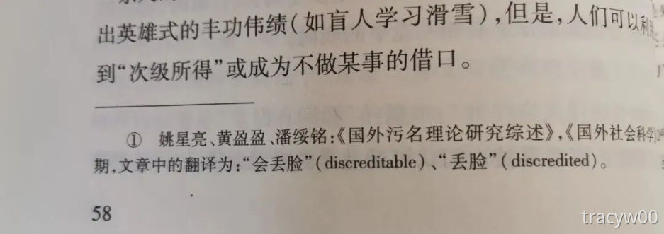

# 《探索残障：一个社会学引论》

<figure><figcaption>
上图是原书的第58页，没想到这能看见黄盈盈和潘绥铭
</figcaption></figure>

我虽然不是学社会学的，但是社会人群接触得多，有自己的观察规律和见解。不论是听涛哥的瑶族研究，还是看黄盈盈的《小姐研究二十年》，后劲都很大。四月我开始尝试看社会学的研究《探索残障：一个社会学引论》。

> 本书对自20世纪60年代以来不同寻常的残障运动给予了高度关注。通过描述残障人士和他们的组织所领导的各种运动，挑战了极度关注个体功能限制和身心异常的“慢性疾病和残障”的主流观点。成功地推动了残障模式的社会转型，从关注伤残有病的个体转向到日常生活中伤残者所经历的各类社会、文化、经济和政治限制上来。该书对残障和贫困、就业、文化表达、残障权利、服务中的使用者参与、反歧视立法、和优生学等都有高度关注，充分体现社会学界中研究中关注残障问题的学者所独特的研究深度和视角。
>
> 作者Colin Barnes是身有残障和特殊教育的幸存者，创立了残障研究中心、残障出版社、英国残障博物馆。

这本书是2010年发行的第二版，年代比较接近，很多观点放到今天还能用，比如社会对残障人士的看待和宣传，大众对残障的隐形霸权。在太子湾，我在隔壁看着路人对我朋友们讲“盲人怎么出来玩了”，很不是滋味。

## 01 损伤 残疾 残障 

直到20世纪中叶，英国法律才开始使用“残障”这一统称，1948年《国家救助法》的界定涵盖了“盲人、有部分视力的人、聋人、重听人士、肢体障碍一般性类别等”。20世纪60年代末，英国的第一次全国调查从损伤（impairment）、残疾（disablement）、残损（handicap）分类。随着时间流逝，损伤（“残障”）的定义逐渐变大，囊括了“解剖学的、生理学的或心理学的异常或损伤”。

1980年，WHO发布《国际损伤、残疾和残障分类》，进行进一步解释：

**损伤（impairment）**：心理上、生理上或解剖上的结构或功能的不同程度的丧失或异常。比如丧失肢体、视觉受损、心理抑郁这些“病理”上的特征。

**残疾（disability）**：因残损而导致能力（ability）受限或缺失，以致无法以公认的正常人方式或在正常人能力范围内实施某种行为。这种表述侧重于表现人缺失了功能，比如因为失聪，无法进行听力健全者的说话沟通。

**残障（handicap）**：由于残损或残疾而导致的个人在社会生活上的障碍，这种障碍限制了或妨碍了个人在社会上（按其年龄、性别和社会及文化背景）应发挥的作用”。这里则是将人放在社会中进行看待，比如下肢残疾人士，在出席会议时会有行动的不便。但由于handicap在历史上和乞讨低能关联，英语国家的人把这个单词视为压迫的意涵。

这三个概念是递进的关系，疾病或失调形成表象的“损伤”，损伤放到具体的人身上是“残疾”，“残疾”的人以社会角度看是“残障”。画图表述如下图：

<figure><figcaption></figcaption></figure>

“残疾人”是国内的法定称谓，但我感觉跟handicap半斤八两，“残”和“疾”绑定在一起，残好像跟以往的同性恋一样，成了一种病。在此之前的“残废”，更是带有鄙视的意味。**我还是更喜欢“残障”，障碍每个人每天都可能遇到。**小时候坐公交是“请为老人、孕妇、儿童、残疾人让座”，最近坐杭州二号线，发现广播讲的是“残障人士”，不错嘛。

## 02 功能主义 

最早出现在1951年Talcott Parsons 的《社会系统》。他假定了社会系统的有效运转有赖于个体必要的社会角色的发挥，把健康界定为一种“正常”、稳定、支撑个体拥有最佳角色能力的状态，反之疾病是具有破坏性的。

患者和医生之间的互利和目标一致，维系了病人角色。病人有两种义务和两种权利：患者有义务得到医疗诊断并且有义务配合开出的处方治疗方案；病人“有义务”认识到他们的状态是不理想的。个体一旦被医生诊断有病，就从“正常”的社会角色要求中解脱出来；个体对于他们的疾患并无个人责任，他们也无法像人们所期待的那样仅仅靠“意志力量”就能恢复过来。

1956年，Thomas Szasz和Marc Hollender提出了三种医患关系：主动-被动型，向导-合作型，双方参与型。

## 03 污名 

“污名”之成为社会科学中的一个核心概念要归功于戈夫曼。美国社会学家欧文·戈夫曼在1963年发表《污名》，最早对污名展开专门研究。他将污名定义为一种与社会期望不符合的特征，其拥有者在社会互动中常遭遇身份、信誉或价值受损，并产生羞愧、耻辱和犯罪感等情感。

污名指的是从完全的普通的人到遭到玷污和贬值的人。被玷污的原因包含各种身体的畸形、个人形象上的伤疤、侏儒、盲人、丑八怪、同性恋、精神病患者，甚至是亲属关系。

是的，缺乏社会认可也会传染，亲密的家庭成员和朋友可能要承担“连带污名”。对于有可见的污名的人而言，困难在于如何管理社会交往中的紧张，并恢复他们的地位和身份认同。一系列的回应方式包括矫治式的外科手术（手术去疤），做出英雄式的丰功伟绩（盲人学滑雪）。

有污名的人有三种应对策略：一笔带过：对那些未泄露的让自我丟脸的信息的管理，不论是社会信息还是象征性信息。掩盖：“对丢脸的事所造成的紧张的管理”的一种困境，污名是明显的，且各种努力都是要确保它没有破坏社会互动。回避：去除和“正常人”在一起的社会活动。为了得到合适的调节，被污名的人必须了解“正常人”是如何看待他们的。

进入“正常”社会的社会化过程，为“道德职业”提供了基础，这也取决于个体的污名是与生俱来的还是后来有的。书中讲先天损伤的人是消极态度，但我目前都没接触过消极处世的先天盲朋友，明眼人倒挺多。在家庭中已有相似病症的人早期体验很积极，但一旦加入同龄人群活动和参加工作后，就充分意识到外部世界的社会阻碍、歧视。后天损伤的人不愿意被界定为残障者，因为早已接受残障是个人悲剧的观点。**残障的个人悲剧视角获得了意识形态霸权，已经成为了“自然化”的常识。**

消费者文化和健康主义的兴起，是导致老化的身体和残障的身体成为巨大焦虑的渊源。如果一个身体没有“正常”运行或显得“正常”，在外表和概念上都被认为是不对劲的，无障碍适老化的公共设施的缺乏便是一个例证。

## 04 三个历史阶段 

1.前工业时期：不会将伤残人士排斥在经济参与之外，但是他们处于社会的底层，伴随着贫穷和失业。

2.资本主义工业化社会：此时以医院为基础的医学的发展和避难所的出现。工伤致残的人增加，关心他们的保障和康复的专家也在增多。

3.后工业社会：这预示着社会中残疾人重新执政整合斗争的来临。新技术能确保最严重的伤残者操作环境控制，使他们能够相对独立地在社区中生活；但也容易忽视了技术既可以赋权又可以剥夺权力的事实——新技术可能只是将残疾人的依赖从一组专家换成另一组。

历史上对残障的排挤往往附带性别和种族。残障女性要么被女权主义分析忽略，要么被认为是被动的受害者。残障女性自身也会通过夸大风险或剥夺选择权利，而阻碍她们成为母亲。她们担心把损伤遗传给孩子，或是质疑她们成为“好母亲”的能力。“残疾黑人”则形成了一个“少数人中的离散少数”，在“黑人团体”中经常被边缘化，因为他们被排除在就业和娱乐活动范围外。但排他性是未知数，比如相同条件的残疾白人比残疾黑人更有竞争力，但相同工作条件下学习困难的白人更可能被请出餐厅。

## 05 刻板印象 

从历史上看，整个欧洲文化都有一种“迷恋差异景观”情节和关注“有缺陷的”“不正常的”身体和思想的习惯。残障人的“他者”形象往往被当作娱乐素材或引起非残障人士恐惧和感伤的来源，公开展示身体“不正常”的文化贯穿了整个中世纪。19世纪出现舞台“怪胎秀”，在马戏团、狂欢节、集市等娱乐场所，以正式的有组织的形式去展示那些身体、精神或行为方面被认为有异常的人。因为怪胎秀的盛行，20世纪初美国甚至出台了限丑法，对身材面貌肯能会冒犯或者吓到“正常人”的丑人的日常生活进行限制。20世纪末，对残障人的文化排斥似乎已根深蒂固、无处不在。近几十年来，残障人在媒体和其他艺术形式如文学、电影和摄影中的形象呈现，强化了当今社会作为一个残障人的意义，并合理化了“有缺陷”的人所得到的待遇。

在文学上，残障人被描绘为软弱的和缺乏吸引力的，残障经常被作为罪恶或者邪恶的比喻，这种分析对应了一种压迫形式。残障人形象经常被歪曲或限于片面，或是与犯罪和越轨纠缠不清，或是勉强是人、可怜可悲的狭隘形象。与残疾人有关的最流行的故事集中在药物治疗、治愈、个人的“特殊成就”。

广告同样强化了负面形象，通常徘徊于同情与怜悯之间。慈善广告有三个阶段：呼吁慈善捐助，赞颂“勇敢和出色”，呼吁大众“看能力不看残障”。摄影试图展示正面形象，但很容易陷入“对斗争和压迫的拒绝、否认或压制”。比如美国总统罗斯福流传下35000张照片，只有少数几张体现了他是需要坐轮椅的。

刻板印象的塑造带着性别偏见。由于女性已经被看作脆弱的、被动的和依赖的，所以女性残障人的艺术形象范围就更窄，大多被塑造成悲剧或圣洁角色。虽然有部分男性残障人被打造成“超级小强”，这一类型的女性却屈指可数。虽然女权主义者试图挑战性别刻板印象，反对一边倒地把女性塑造为传统主内的角色，但残障女性普遍支持媒体把残障人塑造成“主流”贤妻良母的做法，因为她们经常被剥夺成为贤妻良母的机会。

## 06 媒体的8个残障观 

1.医疗模式：残障是一种疾病或者功能障碍；

2.社会病理学模式:残障人是弱势群体，需要支持；

3.“超级小强”模式：残障人是异常的人，身残志坚，追求超人壮举；

4.公民权模式:作为少数群体成员，残障人有权利感到不满；

5.文化多元模式:残障人是有多方面的，残障并不是唯一的问题；

6.商业模式:残障人总体而言是代价不菲的，特别是对私人／商业公司而言；

7.法律模式:残障人享有法律权利；

8.消费者模式:残障人是有待开发的巨大市场。

## 07 优生学 

优生学由达尔文的表兄弟高尔顿提出，指通过科学地改良人类遗传物质使人类更好地繁殖。有缺陷的身体与智力被认为是对社会其他人有“危险”和“威胁”的，像社会达尔文主义那样将具有“严重”损伤的残疾人归类为“突变”、退化。优生学还强调了智力与身体的缺陷和一系列罪恶，如犯罪、流浪、酗酒、卖淫及失业等之间的联系。因此，一切形式的身体、感官和认知障碍都被认为是威胁社会进步的。

在优生学的影响下，一些西方国家推行过极不人道的政策：

美国支持优生运动时，做过仿照农村牲畜表演的“优良婴儿竞赛”，对罪犯和“弱智者”的强制绝育和有选择地限制某些民族移民。1907-1960年，种族歧视导致超过六万美国黑人妇女被强行绝育。

希特勒是将“生病、虚弱和畸形的孩子”安乐死的斯巴达政策的崇拜者，他在位时残疾人视为“无用的食者”和“不值得活的生命”。1933.7.26-1939.9.1，德国医生为阻止一系列有遗传问题的孩子出生，使约37.5万人绝育，并有超过27万被视为“人类肉体和精神的悲剧”的残疾人被安乐死。

遗传医学就其本身来说并不是保证消除残障的一种创新，因为大部分的残障是由于工作环境、意外、暴力后天获得的，并随着年龄增长而发展。

