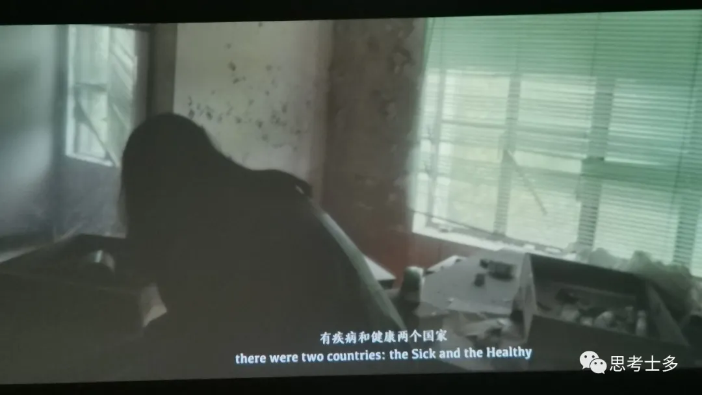

# 《失明症漫记》：萨拉马戈获诺奖作品

<figure><figcaption>
上图是《雾中来的人 2037》的片段，“有疾病和健康两个国家”
</figcaption></figure>

[上次去浙江美术馆](http://mp.weixin.qq.com/s?\_\_biz=Mzg5NDYxMzU4Ng==\&mid=2247485711\&idx=1\&sn=7c8c4f002a9f0fc8839e74c9114cb1e9\&chksm=c01da832f76a2124c343c7029f94f71504b01cd85d275f2362a917b38ebee2b44ff1f9877294\&scene=21#wechat\_redirect)，有个展览《悬停的身影》，里面影像作品《雾中来的人 2037》很吸引我，我站在那一直看到片尾。片尾说“灵感来自若泽·萨拉马戈的小说《失明症漫记》”，于是把书添加进书架，6月份在微信读书上读完了。

> 街上出现了第一个突然失明的人，紧接着是第二个、第三个……一种会传染的失明症在城市蔓延，无人知晓疫情为何爆发、何时结束。失明症造成了前所未有的恐慌与灾难，一批又一批感染者被集中隔离。食物短缺，组织崩溃，文明与尊严变得不堪一击。人们逐渐剥离道德的外衣，陷入比失明更绝望的苦难境地。在这些人中，只有一个女人还能看见。她的眼睛，是这个疯狂的世界里唯一尚存的理智。
>
> 若泽·萨拉马戈(José Saramago，1922-2010)，1998年荣获诺贝尔文学奖，葡语世界获此殊荣的第一人。
>
>
>
> 《失明症漫记》. \[葡]若泽·萨拉马戈, 范维信译. 河南文艺出版社, 2022

后来发现书的英文版《_Blindness》_早就在我ipad……去年找无障碍的书籍，输关键词blind、accessibility、disability，在zlibrary下了几本英文版，其中包括这本，以为这本也是学术文献。毕业后整理文件发现，作者有点眼熟？

## **01 简介**

我读的版本由读客出版，读客的审美大家都懂的。我看着书的封面觉得说不出的诡异，读了里面的内容更加。一种无力的心寒。看着医生妻子独自目睹（物理和心理意义的）肮脏的无助，我一度不忍心读下去。看着历史不断重复的战栗——“隔离”的描写，跟我们前三年经历的太像了。书的隐喻又像《鼠疫》，又像《1984》，社会秩序的打破、重建、又打破，人类沦为只求生存的动物。

书中的设定是一场只能看见白色的失明症“瘟疫”悄然爆发，不知过了多久又悄然消失。几乎所有人都看不见了，除了一位善良的眼科医生妻子。最后妻子在教堂中发现的异常，像是给这场闹剧一个魔幻的解释。

所有的人物都没有名字，都用职业或者特征指代，医生、医生妻子、偷车贼、墨镜姑娘、老人……我猜萨拉马戈可能去观察过盲人的生活，这个描写很真实。在盲推店里面，视障者大多习惯用“1号”“5号”等数字代称，而不是真实姓名，这样更容易记忆和叫唤。

## **02 摘录：盲**

**如果你能看，就要看见，如果你能看见，就要仔细观察。**

盲人生活在黑暗之中，但这种黑暗只不过是缺少光亮，我们所说的失明症只不过是遮住了人和物的外表，而这些人和物还完整无缺地存在于那层黑色面纱后面。现在，他的情况却相反，他被淹没在一片白色之中。这白色如此明亮，如此浓密，不仅吸收了一切，还吞没了一切，不仅吞没了颜色，还把一切人和物本身都完全吞没了，这样它们就变得双倍无形。

白色失明，与全盲恰恰相反，全盲即黑蒙，是完全的黑暗，除非存在一种白色黑蒙，姑且这么说，**白的黑色**。

我们离开世界太远了，过不了多久就会不知道自己是谁，连叫什么名字也记不清楚说不出来了，对我们来说，名字有什么用呢，有什么用呢，没有哪一条狗是通过人们给起的名字认出和认识另一条狗的，它们通过气味确认自己和其他狗的身份。在这里，我们是另一种狗，通过吠叫和说话声相互认识，**而其他方面，长相，眼睛，头发和皮肤的颜色，通通没有用，仿佛不存在。**

眼睛看不见不在的眼睛(the eye that refuses to acknowledge its own absense)

所以，这群盲人罪犯中有一名从前就是被称为盲人的那种正常盲人，他显然和其他盲人一起被捉来了，当时那些猎手不会调查一番，您是**新式盲人还是旧式盲人**，告诉我们您是怎样失明的。

盲人们站在变成一片火海的大楼前，感到大火的热浪烘烤着自己的脸，觉得这大火有点像护身符，如同原来的墙壁一样，既是监狱同时又是保障。他们紧紧挤成一团，像一群羊，谁也不想走散，他们知道，没有牧人去寻找丢失的羊。

所有的故事都像《创世记》一样，当时没有任何人在场，没有任何人目睹了一切，但人人都知道发生了什么事。

**我想我们没有失明，我想我们本来是盲人；能看得见的盲人；能看但又看不见的盲人。**

## **03 摘录：秩序**

以观后效。以观后效，这是部长的原话，听起来用意深刻，其实是因为一时找不到其他托词而故弄玄虚，后来他更准确地解释了自己的想法。他的意思是说，既可以是四十天，也可以是四十个星期，或者四十个月，甚或四十年，重要的是那些人不得从隔离区离开。

正如第一天宣布的那样，他们要重播对各宿舍的指示和住宿者必须遵守的规矩，注意，政府为不得不强行行使自己的权力履行自己的义务感到遗憾，此举是为了全面保护公众，等等。

他们知道，今天上午团长在军营说过，盲人的问题只能靠把他们全都从肉体上消灭来解决，包括已经失明和必将失明的人，无须假惺惺地考虑什么人道主义，团长的话与切除坏死的肢体以拯救生命的说法有异曲同工之妙，他解释说，**狗死了，它的狂犬病自然就治好了。**

正是由于意识到责任大大加重，也许害怕发生新的暴乱，这种可能性绝不可忽视，所以当局改变了做法，现在食物按时送到，并且数量准确。

面对这种形势，政府别无他法，只得紧急开倒车，放宽关于隔离地点和空间的标准，立即临时征用废弃的工厂，无人礼拜的庙宇，体育馆和闲置的仓库。两天前已经在谈论建立野战帐篷营地，戴黑眼罩的老人说。开始的时候，也就是说最早的时候，一些慈善组织还有志愿者去照顾失明者，为他们整理床铺，清扫厕所，洗衣服，做饭，没有这些起码的关心，生活很快会变得难以忍受，甚至对看得见的人来说也是如此。

不幸的是，这些祝愿不久便成了连篇空话，政府的期望和科学界的预见通通付诸东流。失明症在蔓延，但不像突然出现的海潮那样汹涌澎湃，摧枯拉朽，淹没一切，而是如同千万条涓涓细流缓缓渗透，逐渐把土地泡软，悄然间把它变成一片泽国。

## **04 摘录：人性**

随着时代的推移，社会的进化和基因的置换，我们最后把道德感与血液的颜色和眼泪的咸淡混为一谈，仿佛这还不够，**我们还把眼睛变成了朝向灵魂的镜子，结果它往往毫无保留地展示出我们嘴上试图否认的东西**。

**美德在通往完美的艰辛道路上总是遇到困难，而罪孽和恶习很受好运垂青。**

不错，盲人们是死了，你们仔细看看，他们一动不动，也不呼吸，但是，**谁能说这种白色眼疾不是一种灵魂疾病呢**，既然这样，当然这是假设，那么那些盲人的灵魂从来不曾像现在这样无拘无束，脱离了躯体更能为所欲为，尤其是坏事，尽人皆知，做坏事最容易。

医生的妻子发现了他们的卑鄙行为，但觉得还是谨慎为妙，没有揭穿。她甚至不敢去想说出自己不是盲人的真相后可能产生的后果，**轻则变成大家的女仆，重则成为一些人的奴隶**。

我们应当有耐心，让时间说话，我们早就该学会并且永远记住，命运到任何地方都必须走许多弯路，只有命运知道费了多少周折才在这里竖起了这幅地图。

请你们原谅我这番伦理道德方面的说教，你们不知道，也不可能知道在盲人世界里有眼睛是什么滋味，我不是女王，绝对不是，只是个生来注定目睹这悲惨场面的人，你们能感受，而我既能感受又能看到。

都说医生的妻子有钢铁般的神经，但她现在也在一个代词，一个副词，一个动词，一个形容词的作用下泣涕涟涟，尽管它们只是区区的语法现象，只是符号，同样，那两个女人，另外两个女人，两个不定代词，也哭哭啼啼地和她拥抱在一起，三个赤身裸体的淑女立在瓢泼大雨中。

**我们现在唯一能够创造的奇迹是继续活下去**，妻子说，日复一日地维持脆弱的生命，仿佛生命也失明了，不知道走向何方，也许就是这样，也许生命真的不知道走向何方，于是，它使我们变得聪明之后又落入我们手中，任凭我们处置，而这就是我们能做的一切了。

