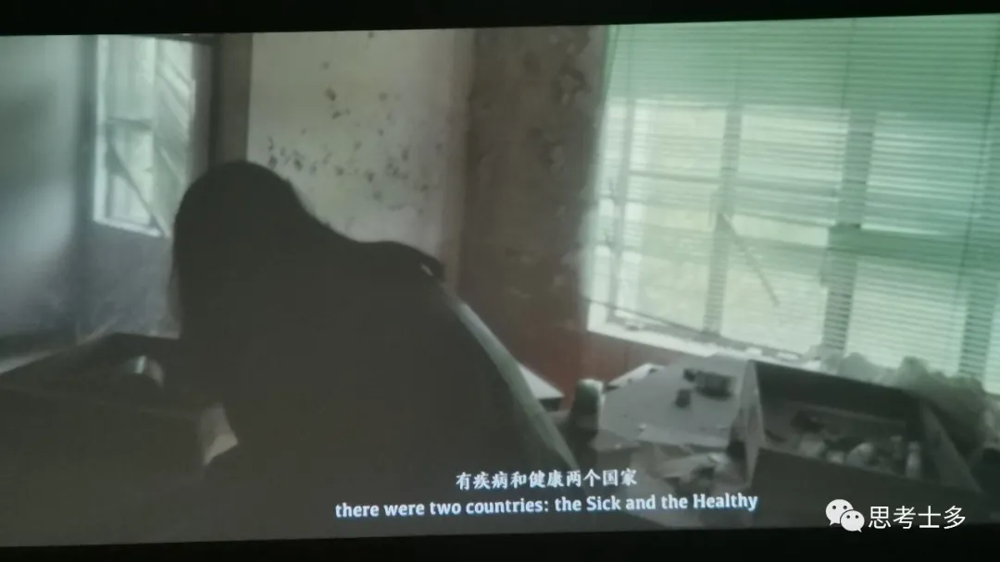

# 光系小邮箱

前阵子因为工作，我用回了邮箱，然后嘲讽对面邮件格式都用错的时候，打开回了我两三年前写给障行人的邮件。本来是给隔壁姐妹展示怎么用邮件格式的，看回这些邮件写的内容，好怀念啊，那时候还是原来的婷姐；也好耀眼啊，像是泛着圣光……

我做台湾设计展的性格测试做到是光系，就很enfj、阳光小狗的刻板印象。我想要不存个档吧，让过去的自己把日渐阴暗的自己照醒吧。这个系列的名字嘛，就用光系好啦，【光系小邮箱】，也能复用【追光探店】的底封，不用再p一个了（偷懒）。

<figure><figcaption>
测试结果，真的很光明……
</figcaption></figure>

## 三代目录取通知书

在障行三代目进来前，我做了挺多准备，除了工作上给他们安排好适应期的任务，编辑好短信、写好定期发送的录取邮件、囤了些广东饮料，当时好像还被谭总说障行的孩子很幸福？结合后来给障行人的各种礼物，我感觉如果我谈恋爱了，应该会是个很有情趣和仪式感的人……

### **第一封邮件**

From:  #########\
Date:  Sat, Nov 21, 2020 06:00 PM\
To:  三代目全体\
Subject:  【杭电创益行动15th-障行无阻3rd成员录取通知书】

亲爱的##：

&#x20;   恭喜你正式成为障行无阻项目组的一员。

&#x20;   障行无阻是好玩的，能接触一个不一样的世界、结识很多善良又有趣的视障者长辈/朋友；障行无阻也是当前涉及服务业最多的项目组，你刚开始可能会吃不消。要记得我会与你抱拥，雨再降也当吹吹风。

_<mark style="background-color:orange;">孤单的世界</mark>_\
_<mark style="background-color:orange;">承受贯彻理想那彷徨</mark>_\
_<mark style="background-color:orange;">坚信着无论有苦痛</mark>_\
_<mark style="background-color:orange;">仍要一心努力着去闯</mark>_\
_<mark style="background-color:orange;">漆黑的世界</mark>_\
_<mark style="background-color:orange;">无尽探索美景的长廊</mark>_\
_<mark style="background-color:orange;">原来这大片地图上</mark>_\
_<mark style="background-color:orange;">存在过耀眼阳光</mark>_

&#x20;   先扔给你们一个游戏包，探索视障者与众不同的视界吧\~（但由于企业邮限制大小是2G……还是用回百度云吧╮(╯\_╰)╭:https://pan.baidu.com/s/1r6XjmnYhLDyBoGQ8jBR6rQ 提取码:4w8d）

&#x20;   为了让你们感受一下障行的传统白嫖文化，请在收到短信后及时回复，我将根据回复短信先后拉你们进群。数码宝贝组（dbq老digimon粉的我只想到这个八人组）集结完毕后将在群里面公布神秘消息。\[]\~(￣▽￣)\~\*

（感谢你们的到来，让我可以重操写邮件哔哔的传统技能）

Best regards!

\------------------\
\###\
Tracy\
杭州电子科技大学创行团队 项目经理\
Project Manager, Hangzhou Dianzi University Enaction Team\
Cell:#######\
Email:########\
P.C.:310018\
Add.:浙江省杭州市下沙高教园区2号大街1158号\
\--------------------------------- \
简单 务实 高效 对结果负责\
\

### **第一条短信**

【杭电创益行动】我的天空里没有太阳，总是黑夜，但并不暗，因为有东西代替了太阳。恭喜你正式成为了杭州电子科技大学创益行动团队障行无阻的成员！收到请回复姓名和“障行无阻掂过碌蔗！”，开启你在视障者世界的探索之旅、接收“障行葫芦娃”满满的关怀吧。\
（粤语小课堂：掂过碌蔗，寓意万事顺利、节节高升。）\
＃坚持善良且主动

<figure><figcaption>
那条短信我还留在手机没删嘿嘿
</figcaption></figure>

### **第一次会**

【障行人内部福利】\
之障行传统白嫖文化\
┄┄┄┄┄┄┄┄┄┄

欢迎障行digimon集结完毕～

经过抢人大战（不想再经历\[苦涩]），最终敲定了在场的大家，完成了障行和你们之间的双向选择。

从内蒙奶茶牛肉干，到梧州龟苓膏、慈溪杨梅、广式月饼，障行一如既往地进行队内白嫖行为。为了让你们体验白嫖的快感（呸障行的团结），婷姐在此提供老广的经典饮料，诸位任选一：

①小白级：广式菠萝啤（不含酒精，就菠萝味汽水）\
②进阶级：黄振龙金银花凉茶，苦度+++\
③苦逼级：徐其修凉茶，苦度++++（需自泡，温知识：凉茶是热的）\
④地狱级：亚洲沙士（健康汽水，就是有股风油精味……鄙人的话喝了半罐就能适应上头）

【新老队员抠序号进行选择，也可以行行好给我留库存\[旺柴]】\

<figure><figcaption>
第一次会那天用饮料叠的金字塔
</figcaption></figure>

## 生日祝福篇

生日祝福是我设给障行的一个传统吧。每当有一个障行人过生日了，晚上我就会给他发20多秒的语音唱粤语的经典生日歌《祝寿曲》，并送上文字版。这个轮回从冬冬开始，刚好他进队那天就是生日；到思颖结束，把去年没轮到的续上，后来日期相近又给冬冬送了一回，算是有始有终。

因为我自认为（而且也真的是）唱歌辣鸡，我给他们唱的几乎都是粤语歌，这样他们就听不出来跑不跑调了哈哈哈。有时候遇上节日，我会换成《祝寿曲》之外的。

<figure><figcaption>
上图是微信的生日祝福记录
</figcaption></figure>

### **01 婷姐特供生日歌**

**【障行人内部福利】**\
**之婷姐特供粤语生日歌《祝寿曲》**

┄┄┄┄┄┄┄┄┄┄\
粤翻中：\
恭祝你福寿与天齐    \
庆贺你生辰快乐    \
年年都有今日   \
岁岁都有今朝 \
恭喜你～恭喜你 ～～\
係呢度祝我哋嘅##生日快乐，系新嘅一年平安喜乐，#########_（后面的祝福语自由发挥了，每个人不太一样）_

**【障行人内部福利】**\
**之婷姐特供生日歌春节版《财神到》**\
┄┄┄┄┄┄┄┄┄┄\
粤翻中：\
财神到财神到 好心得好报\
财神话财神话 揾钱依正路(赚钱要走正道)\
财神到财神到 好走快两步\
得到佢睇起你(等到他留意你) 你有前途\
係呢度祝文琦生日快乐，喺新嘅一年平安喜乐，牛年大吉（在这里祝文琦生日快乐，在新的一年里平安喜乐，牛年大吉）

**【障行人内部福利】**\
**之婷姐特供生日歌惊蛰版《落雨大》**\
┄┄┄┄┄┄┄┄┄┄\
粤翻中：\
落雨大 水浸街\
阿哥担柴上街卖\
阿嫂出街着花鞋\
花鞋花袜花腰带\
珍珠蝴蝶两边排\
係呢度祝菲菲公主生日快乐，喺新嘅一年平安喜乐，青春靓丽\
_（菲菲是广东人，虽然他不会说粤语，默认他看得懂了（用“他”是因为菲菲真是个男的））_

**【障行人内部福利】**\
**之婷姐特供生日祝福收山版《Get Lucky》**\
┄┄┄┄┄┄┄┄┄┄\
英：出自蠢朋克的Get Lucky\
粤：不知不觉做咗一年，收山之作肯定要搞大滴嗝啦～系呢度就祝我哋嘅冬冬生日快乐，系新嘅一年平安喜乐，落力滴醒目滴\
（不知不觉这做了一年了，收山之作肯定要做个大的վ'ᴗ' ի在这里祝我们的冬冬生日快乐，系新嘅一年平安喜乐，努力又聪慧）

\
\
**02 本应是最后一个的**

From:  #########\
Date:  Tue, Nov 16, 2021 08:00 PM\
To:  思颖\
Subject:  恭祝你福寿与天齐\
Attachment:  这是个压缩包.zip

生日快乐啊🎂🎂 &#x20;

欸本来想退休了这个也就停了的，但发现乐遥你王子没循环到，就续费到现在。然后过几天又是冬冬生日了，冬冬去年过生日刚好是进来第一天🚬好吧我再顺便把冬冬的也续费了，我真的要摸鱼了🚬🚬

之前给他们发的都有粤语版生日歌《祝寿曲》，8点估计我还在上课，想要的回复666，9点下课再唱🤟🏻

另，定制版礼物在附件，灵魂画手永不服输

**04 生日祝福终结篇**\
From:  #########\
Date:  Sun, Nov 21, 2021 07:00 AM\
To:  冬冬\
Subject:  冬冬生日快乐【婷姐生日祝福终结篇】

这来源于一个尽职而又悲伤的故事，前几天思颖生日的时候才说着🚬既然两个挺靠近，那就四舍五入都弄吧

也算是有始有终，从你开始，到你结束

招新完毕，四代目来了，不知道你们交接如何（冬冬的排版给我支楞起来\~\_\~）虽然我现在不在，但总是退休退了个寂寞，很多事我也知道，仿佛一个隐藏款(′д｀σ)σ

权且上帝视角一回吧，god bless you 福寿与天齐，平安喜乐，新嗝一年做个醒目仔🎂🎉🍺老环节要的扣666，听腻了粤语想换个语种的扣678\
\

## **掌门诀别书**

\----------------- Original ------------------\
From:  #########\
Date:  Sun, May 23, 2021 09:30 PM\
To:  ###########\
Subject:  【障行无阻-第三代掌门诀别书】&#x20;

<figure><figcaption>
菲菲写的障行咒文经壁纸我太喜欢了，虽然背后是一个有点气人又有点心酸的故事
</figcaption></figure>

To 障行十兄弟：

&#x20;当你们收到这封邮件，我的退休生活就正式拉开帷幕了，下面的签名也是最后一次使用  &#x20;

（当然我觉得退休还是不太可能的……二代目里跟晓华最熟的我还没对接你们和他，我视障朋友多消息比你们多，真正的朋友哪有传承给下一代这一说。以后我会是路亚姐那样的幕后人员了）

你们这一代，有视障者志愿者社群，有多方媒体账号，有总部亲自对接，也开始搞大点联系基金会了。好好传承啊，现在的视障者社群比起之前没那么腥风血雨，甚至没有公关危机，这方面闲了就攻其它方面啊。其它大资源不管水深不深你们都要把持得住    障行现在是十兄弟，没想到这年是障行这么大体量……隔壁亲历亲为在19年开始（那时还叫未艾方兴）就是体量最大的，那时据说很欢乐，但emm我没怎么蹲到他们的实际进展？给我的教训就是人要少而精，分好职能。现在障行体量大了未必是我担心的那种发展方向，咱们既然搞大了那就搞大点嘛。体量大担心的是信息不透明，以后有问题直接群里发问，信息互通也要做好

障行账号我会一直关注的，障行公众号的关注者甚至还有很多初代目。你们好好干，我们这些前辈都在看着

不排除我以校友的身份单独对线失职人员，骂得更狠

<figure><figcaption></figcaption></figure>

不知不觉离二代目的离去已经有一个月了。开始那几天我情绪的确低落，一年的否定、反问、枪打出头鸟，延续到最后一刻，受够了。所以啊，某位大哥提出来的请校友帮我拉回去我不会用的：我在障行投入的心血最多，得到的收获最多。虽然是想过为团队改革，但现在变了不想投入到整个团队了；很悲哀地我对团队有了偏见，留下来也不合适

但你们不必担忧，现在是你们的时代。俊豪是个很好的队长，是高中以一己之力开创校辩论队的人，虽然也是个会把事情全部自己包揽的软柿子哈哈哈。“刺头二人组”的凯文和我至少他留下来了，他能带好的。要是障行被安排到不切实际的规划，不管对象是谁尽管反驳，反驳不过我回来干他娘的   &#x20;

障行的传统就是白嫖。以后二代目的杨梅荔枝那些到了我们会在障行老群通知的。我的粤语生日歌服务，因为王子思颖几乎是轮不上的，所以延续到今年11月，也就是冬冬生日之前了。（话说三代目进来第一天就是冬冬生日，再说一遍天选之子）至于生日歌还继不继续，看王子能不能唱个安徽话版的，我也要\~\~\[狗头保命.jpg]   &#x20;

如果对障行历史和项目推进不太清楚的，欢迎到障行gzh的考古专栏考古，我已经录了20多条音频，现在还没更新完。当然不想听的可以不听，毕竟我把你们都报过一遍，万一听到坏话了不得打死我 \
\
这里是障行无阻，请多多关照，over.\
\
_<mark style="background-color:blue;">我所经历过</mark>_\
_<mark style="background-color:blue;">嘅事瞬间好似录像机在播放</mark>_\
_<mark style="background-color:blue;">欢笑嘅过往</mark>_\
_<mark style="background-color:blue;">失落编织网</mark>_\
_<mark style="background-color:blue;">笑与泪嘅片段回望我一帧帧在看</mark>_\
_<mark style="background-color:blue;">回顾从前所付出既一切仿佛像是梦境</mark>_\
_<mark style="background-color:blue;">我选择不在淡定沉溺</mark>_\
_<mark style="background-color:blue;">因为我正在梦醒</mark>_

\
\------------------\
\###\
Tracy\
杭州电子科技大学创行团队 项目经理\
Project Manager, Hangzhou Dianzi University Enaction Team\
Cell:###########\
Email:##########\
P.C.:310018\
Add.:浙江省杭州市下沙高教园区2号大街1158号\
\---------------------------------\
简单 务实 高效 对结果负责
